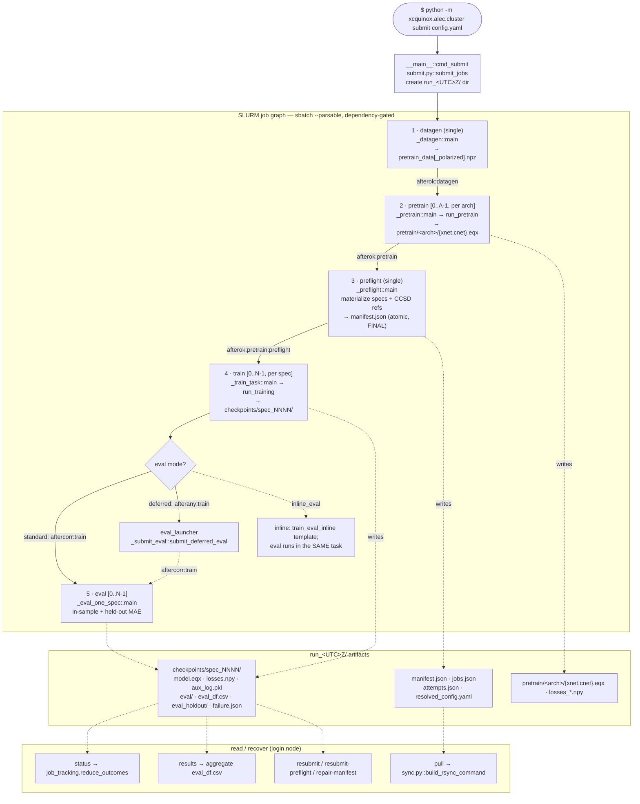
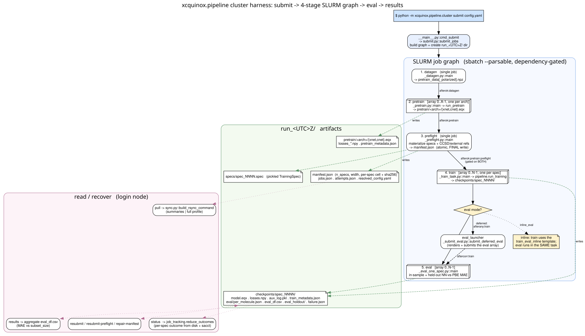
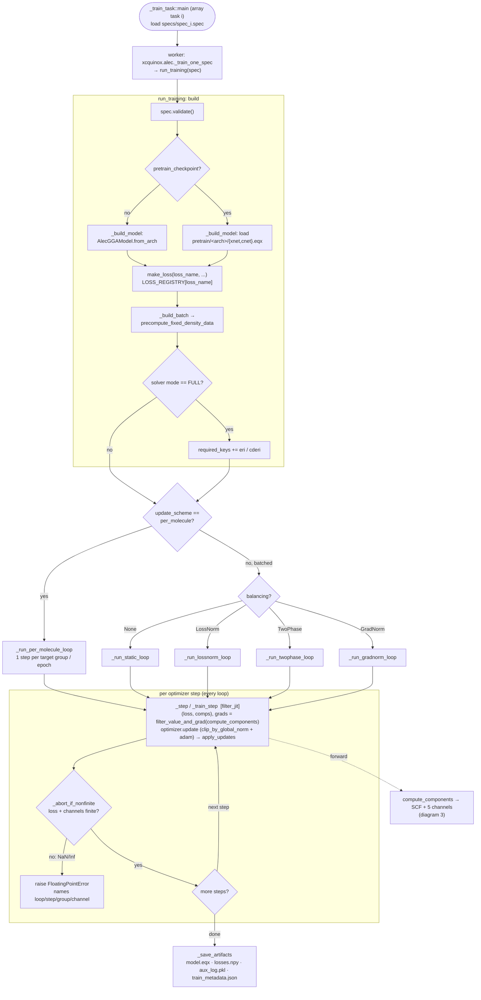
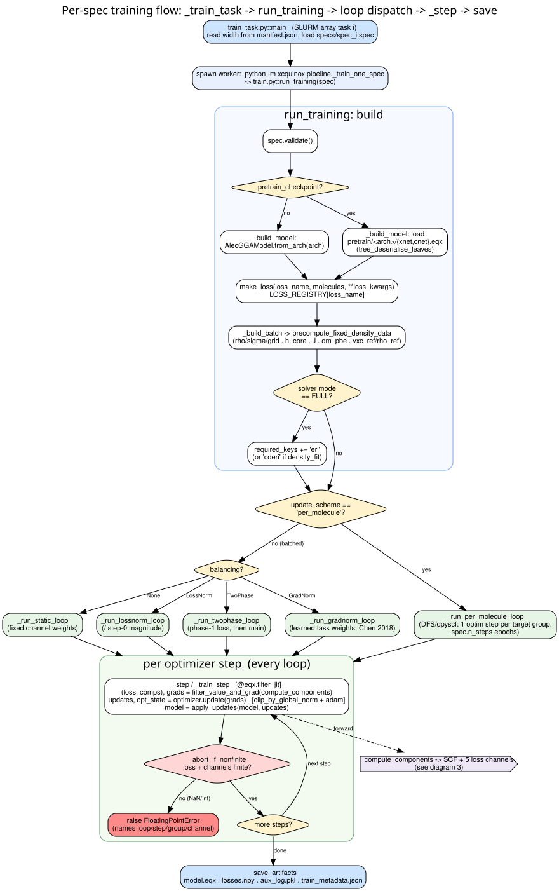
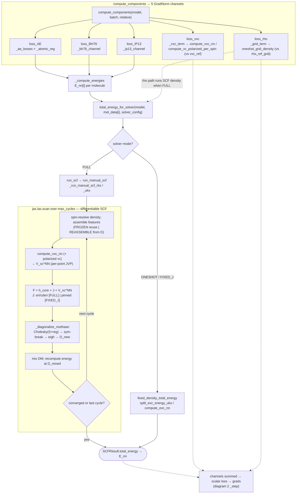
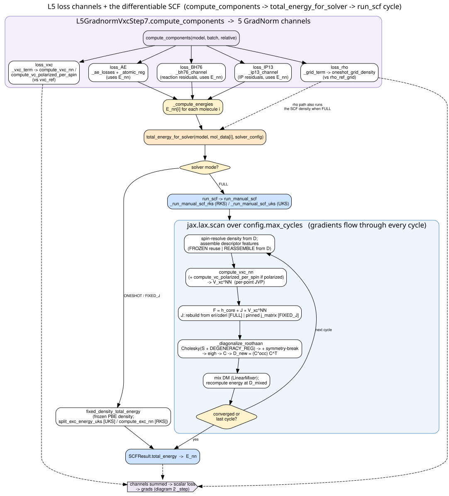
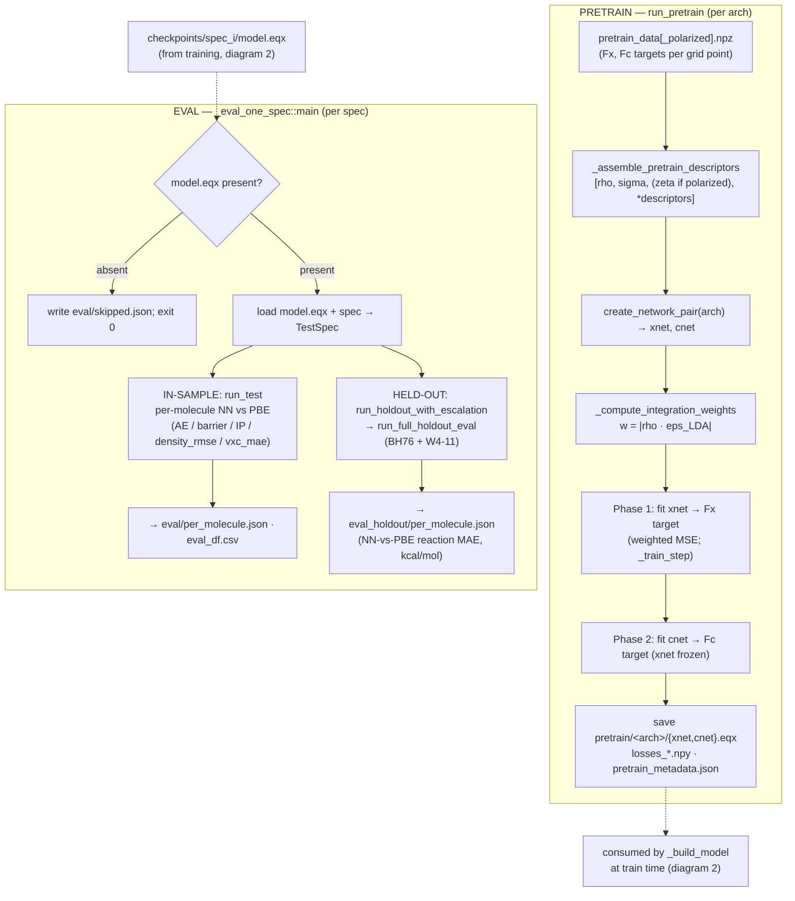
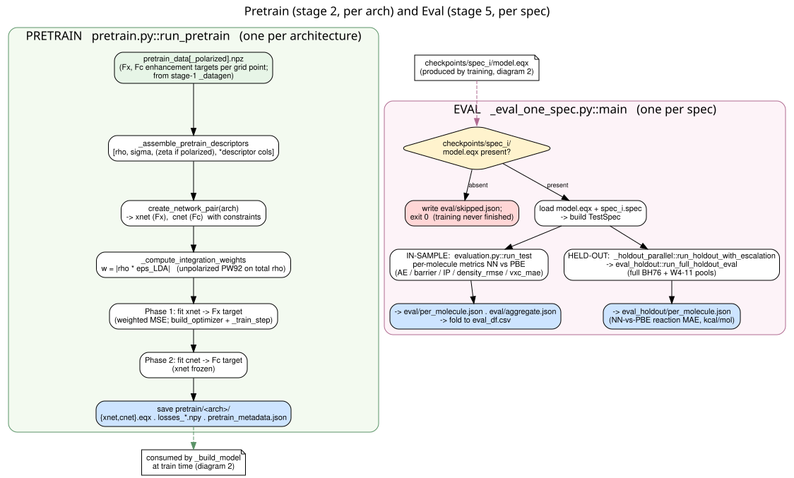

# `xcquinox.alec` training pipeline — code-flow diagrams

Flowcharts of the end-to-end machine-learned-XC training workflow: the SLURM **cluster
harness** (`xcquinox/alec/cluster/`) that orchestrates the job graph, and the **core compute**
(`xcquinox/alec/`) that runs inside each job — model build, the training-loop family, the
differentiable SCF, the loss channels, pretraining, and evaluation.

Each diagram appears twice: an inline **Mermaid** version (renders on GitHub / VS Code /
JupyterLab) and a link to a higher-resolution **Graphviz**-rendered image under
[`diagrams/`](diagrams/). Node labels are `file.py::function`, so the diagrams double as a
code index.

> **Regenerate the images** after editing a `.dot`:
> ```bash
> cd docs/architecture/diagrams
> for f in *.dot; do dot -Tsvg "$f" -o "${f%.dot}.svg"; dot -Tpng -Gdpi=150 "$f" -o "${f%.dot}.png"; done
> ```
> (Mermaid blocks have no build step — they render in any Mermaid-aware viewer.)

---

## 1 · Cluster harness — the 4-stage SLURM job graph

`python -m xcquinox.alec.cluster submit config.yaml` → `__main__.py::cmd_submit` →
`submit.py::submit_jobs`, which creates a fresh `run_<UTC>Z/` directory and submits five
`sbatch --parsable` jobs wired by SLURM dependencies:

- **datagen** (single, no dependency) → `pretrain_data[_polarized].npz` (the per-grid-point
  Fx/Fc enhancement targets every swept architecture needs).
- **pretrain** `[0..A-1]` (`afterok:datagen`) — one task per architecture → `pretrain/<arch>/{xnet,cnet}.eqx`.
- **preflight** (`afterok:pretrain`) — materializes one `TrainingSpec` per grid cell, ensures
  CCSD/external references, and writes `manifest.json` as its **atomic, final** step.
- **train** `[0..N-1]` (`afterok:pretrain:preflight` — gated on **both**) — one task per spec.
- **eval** `[0..N-1]` — `aftercorr:train` in the default mode (eval`[i]` after train`[i]`), or
  folded into the train task (`inline_eval`), or submitted by a deferred `eval_launcher`
  (`afterany:train`).

Outcomes are read back with `status` / `results` / `pull` and recovered with
`resubmit` / `resubmit-preflight` / `repair-manifest`.



[Full-resolution image → `diagrams/01_harness_pipeline.svg`](diagrams/01_harness_pipeline.svg)



---

## 2 · Per-spec training flow — `run_training`

Each train array task (`_train_task.py::main`) spawns a worker that calls
`train.py::run_training(spec)`. It builds the model (fresh `AlecGGAModel.from_arch`, or loaded
from the arch's `pretrain/` checkpoint), builds the batch
(`_build_batch → precompute_fixed_density_data`; the 4-index `eri` / DF `cderi` is added only
when the solver mode is `FULL`), then **dispatches** to one of five loops on `update_scheme`
and `balancing`. Every loop funnels through a single JIT-compiled step
(`filter_value_and_grad → optimizer.update → apply_updates`), guarded by `_abort_if_nonfinite`
— which **raises immediately** on a non-finite loss/gradient, naming the loop/step/group/channel
(the safeguard added after the polarized-correlation NaN). Final state is written by
`_save_artifacts`.



[Full-resolution image → `diagrams/02_training_flow.svg`](diagrams/02_training_flow.svg)



---

## 3 · Loss channels + the differentiable SCF

The L5 loss (`losses.py::L5GradnormVxcStep7.compute_components`) returns five GradNorm
channels. The three energy channels (`loss_AE`, `loss_BH76`, `loss_IP13`) consume per-molecule
energies from `_compute_energies → total_energy_for_solver`, which branches on solver mode:
`ONESHOT`/`FIXED_J` use `fixed_density_total_energy` (frozen PBE density), while `FULL` runs
`run_scf → run_manual_scf`, a differentiable `jax.lax.scan` over `max_cycles` self-consistent
cycles. `loss_vxc` matches the NN potential (`compute_vxc_nn` / `compute_vc_polarized_per_spin`)
against `vxc_ref`; `loss_rho` matches the NN grid density (`oneshot_grid_density`, which itself
runs the SCF density under `FULL`) against `rho_ref_grid`.

> The polarized-correlation NaN fixed earlier this session lives in the `compute_vxc_nn` /
> `_diagonalize_roothaan` part of this loop — the `eigh` cycle differentiated at full spin
> polarization (ζ=±1).



[Full-resolution image → `diagrams/03_scf_and_loss.svg`](diagrams/03_scf_and_loss.svg)



---

## 4 · Pretrain (stage 2) and Eval (stage 5)

**Pretrain** (`pretrain.py::run_pretrain`, once per architecture) loads the datagen `.npz`,
assembles descriptor inputs (inserting the spin-polarization ζ column for polarized cnets),
builds the `xnet`/`cnet` pair, and fits them — exchange first, then correlation with the xnet
frozen — to the per-point Fx/Fc enhancement targets under `|ρ·ε_LDA|` integration weights,
saving `{xnet,cnet}.eqx`. **Eval** (`_eval_one_spec.py::main`, once per spec) skips specs with
no `model.eqx`, else runs the in-sample metrics (`evaluation.py::run_test`) **and** the held-out
BH76+W4-11 pools (`run_holdout_with_escalation → run_full_holdout_eval`), both reporting
NN-vs-PBE error.



[Full-resolution image → `diagrams/04_pretrain_and_eval.svg`](diagrams/04_pretrain_and_eval.svg)



---

### Cross-references

- The harness stages (diagram 1) invoke the per-stage Python entrypoints under
  `xcquinox/alec/cluster/` (`_datagen`, `_pretrain`, `_preflight`, `_train_task`,
  `_eval_one_spec`).
- Diagram 2's `compute_components` box expands into diagram 3.
- Diagram 4's pretrain checkpoints feed diagram 2's `_build_model`; diagram 2's
  `model.eqx` feeds diagram 4's eval.
