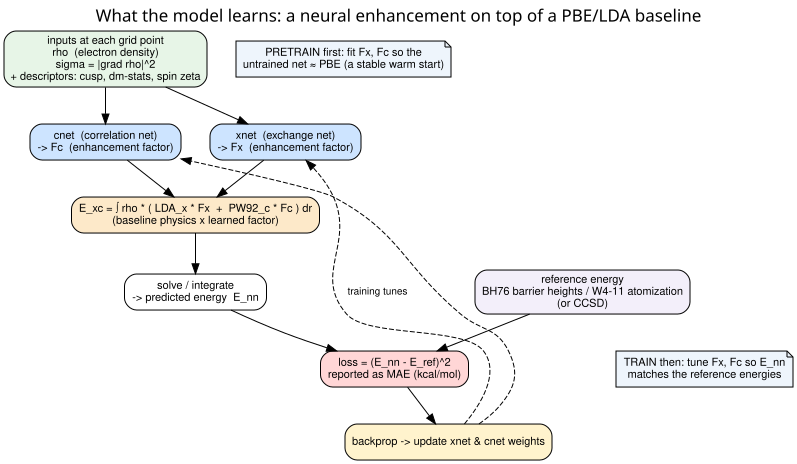
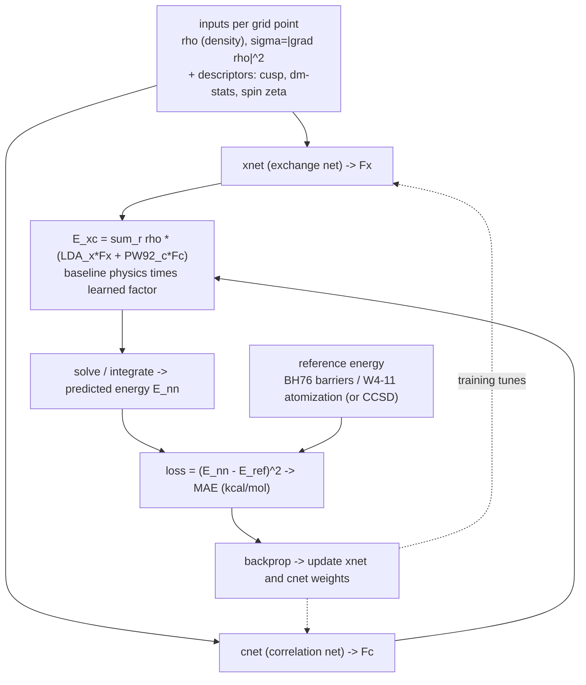
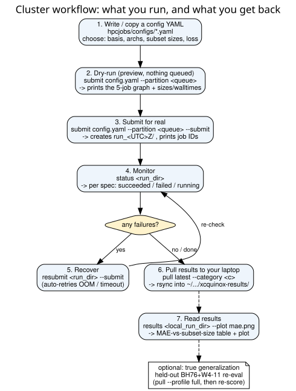
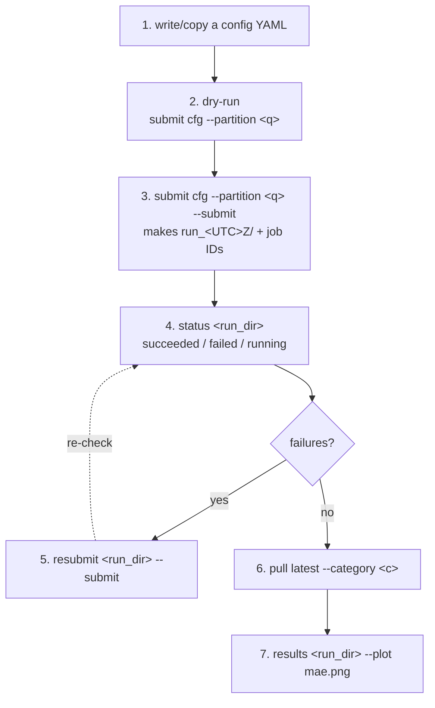

# xcquinox.alec user guide: training an ML exchange-correlation functional

A practical guide to using the `xcquinox.alec` toolkit. It covers (1) training and evaluating a
small functional on a laptop, and (2) running and reading a full sweep on the cluster.

For the concepts, read sections 1-2. For a runnable example, skip to the section 3 local
quick-start. For production sweeps, see section 4. The file-to-function internals are in
[architecture/alec_training_flow.md](architecture/alec_training_flow.md).

---

## 1. What it does

A density functional approximates the exchange-correlation (XC) energy of a molecule. Here that
energy is written as a cheap physics baseline (LDA exchange + PW92 correlation, the same form PBE
uses) multiplied by a small neural enhancement factor. Two networks predict those factors at each
integration grid point:

```
E_xc = integral over r of  rho(r) * ( LDA_x(r) * Fx  +  PW92_c(r) * Fc )
```

Fx comes from `xnet`, Fc from `cnet`. With Fx = Fc = 1 everywhere you recover the plain baseline;
the networks learn the small corrections that bring energies in line with high-accuracy
references. You pretrain the nets to reproduce PBE (a stable warm start), train them to match
reference reaction energies, then benchmark against held-out chemistry (BH76 barrier heights,
W4-11 atomization energies).





---

## 2. Concepts

| Concept | Meaning | Where in code |
|---|---|---|
| ML XC functional | `E_xc = sum rho*(eps_x_LDA*Fx + eps_c*Fc)`. The networks learn the enhancement factors `Fx`, `Fc` on a cheap baseline; `Fx=Fc=1` is the plain baseline. | `models.py::AlecGGAModel.eval_exc` |
| xnet / cnet | Two small MLPs that output `Fx` (exchange) and `Fc` (correlation). Initialised so an untrained model is close to PBE. | `models.py`, `networks.py` |
| Descriptors | What the nets see at each grid point: density `rho`, gradient `sigma=|grad rho|^2`, and optionally cusp (nuclear proximity), density-matrix statistics, and spin polarization `zeta`. More descriptors means more physics and a bigger model. | `descriptors.py` |
| Pretrain vs train | Pretrain fits the nets to PBE enhancement targets (a stable warm start). Train then tunes them to match your reference energies and densities. | `pretrain.py::run_pretrain` vs `train.py::run_training` |
| SCF mode | `oneshot` scores on the fixed PBE density (fast). `FULL` is self-consistent: it re-solves with the net's own density each cycle (slower, more physical). | `solver.py::SolverMode` |
| The 5 loss channels | `loss_AE` (atomization energy), `loss_BH76` (reaction barriers), `loss_IP13` (ionization potentials), `loss_vxc` (potential matching), `loss_rho` (density matching). The simple A/B/C/D losses use a subset; `L5_gradnorm_vxc_step7` uses all five with automatic GradNorm balancing. | `losses.py` |
| In-sample vs held-out MAE | In-sample is the error on the molecules you trained on (optimistic). Held-out is the error on a disjoint BH76+W4-11 set, the real test of generalization, reported in kcal/mol vs PBE. | `evaluation.py`, `eval_holdout.py` |
| Polarized correlation | For open-shell systems (atoms, radicals) the correlation net also takes spin polarization `zeta`. Enable with `use_polarized_correlation`. It is a different checkpoint family, so retrain when you flip it. | `config.py`, `models.py::_ec_baseline` |

---

## 3. Local quick-start (no cluster)

The runnable script is [examples/quickstart_local.py](examples/quickstart_local.py). It trains a
functional on three molecules and evaluates it, on CPU, in about a minute:

```bash
JAX_ENABLE_X64=1 JAX_PLATFORMS=cpu python docs/examples/quickstart_local.py
# Training (100 steps on H, O, H2O) ...
#   loss: 2.06e+00  ->  2.80e-05   (100 steps)
#   evaluated 3 molecules; aggregate keys: ['AE_nn', 'E_pbe', 'E_total_nn']
# Done. Artifacts under /tmp/xcq_quickstart_XXXX
```

The steps:

1. Define molecules. A `MoleculeSpec` is a PySCF atom string plus charge, spin (`spin` = number of
   unpaired electrons = 2S), and an element-count tuple:

   ```python
   from xcquinox.alec.config import MoleculeSpec
   H2O = MoleculeSpec(name="H2O", atom="O 0 0 0; H 0 0 0.96; H 0.96 0 0",
                      basis="sto-3g", charge=0, spin=0, atom_composition=(("H", 2), ("O", 1)))
   ```

2. Precompute. `precompute_fixed_density_data(mol)` runs one PBE SCF per molecule and caches its
   density, integration grid, and integrals, so training never re-solves a SCF just to read the
   density.

3. Reference targets. Training needs numbers to fit. The demo uses each molecule's own PBE energy
   and the PBE atomization energy of water as stand-ins; a real run supplies CCSD or experimental
   references. `atom_energies` are the per-element anchors that atomization energies are measured
   against.

4. Build a `TrainingSpec`. Choose the architecture, the loss, and how long to train:

   ```python
   from xcquinox.alec.config import TrainingSpec, get_architecture
   spec = TrainingSpec.from_dicts(
       arch=get_architecture("deep"),     # named arch (depth-4, 32-node x/c nets)
       molecules=mols, targets=targets, atom_energies=atom_energies,
       loss_name="A_atomization",         # fit atomization energies (the simplest loss)
       n_steps=100, lr_start=1e-3, lr_end=1e-5, lr_decay_start=0.0, grad_clip=1.0,
       checkpoint_dir=ckpt, seed=42,
   )
   spec.validate()                        # fail fast on an inconsistent spec
   ```

   The built-in architectures (`config.py::ARCHITECTURES`, via `get_architecture(name)`) include
   `shallow`, `medium`, `deep`, and the feature-toggle variants `deep_attn`, `deep_cusp`,
   `deep_dm`, `deep_combined`, `deep_notransform` (and `*_attn` forms). Registered losses:
   `A_atomization`, `B_atomization_plus_dm`, `C_atomization_plus_grid`, `D1_delta_ae`,
   `D2_delta_ae_plus_dm`, `D3_delta_ae_plus_grid`, `L5_gradnorm_vxc_step7`.

5. Train. `run_training(spec)` writes `model.eqx`, `losses.npy`, `aux_log.pkl`, and
   `train_metadata.json` into `checkpoint_dir`. Watch the loss in `losses.npy` fall.

6. Evaluate. Re-load `model.eqx` into a `TestSpec` and score it with named metrics
   (`total_energy`, `atomization_energy`, `density_rmse`):

   ```python
   from xcquinox.alec.config import TestSpec
   from xcquinox.alec.evaluation import run_test
   test = TestSpec.from_dicts(model_checkpoint=f"{ckpt}/model.eqx", arch=get_architecture("deep"),
                              molecules=mols, metrics=("total_energy", "atomization_energy"),
                              atom_energies=atom_energies, output_dir=f"{workdir}/eval")
   results = run_test(test)               # {"per_molecule": [...], "aggregate": {...}}
   ```

To scale up: pretrain the nets first (`pretrain.py::run_pretrain`, writing `xnet.eqx`/`cnet.eqx`)
and pass that directory as `TrainingSpec(..., pretrain_checkpoint=...)`; switch to a
self-consistent solver with `solver_config=SolverConfig(mode=SolverMode.FULL, max_cycles=3)`; and
use `loss_name="L5_gradnorm_vxc_step7"` for the multi-channel loss. The cluster harness (section 4)
automates this across a grid of molecules and architectures. The
`notebooks/gga_training_example-step{2..7}.ipynb` series works through progressively richer
versions of the same flow.

---

## 4. The cluster workflow

For real functionals you train a grid of (architecture, training-subset-size, ...) on SLURM. You
describe the grid in one YAML config and the harness runs a 5-stage pipeline; you monitor it, pull
the results, and read the held-out MAE.





SeaWulf-specific setup (conda env, symlinks, partitions, exact paths) is in
[hpcjobs/SEAWULF_RUNBOOK.md](../hpcjobs/SEAWULF_RUNBOOK.md). This section explains what the commands
and config knobs mean so the runbook makes sense.

### 4.1 The config, section by section

Take a real one: `hpcjobs/configs/bh76w411_repr.svp_grid2.yaml`.

`sweep:` is the grid. Each axis is a list; the harness trains the Cartesian product, one job per
cell.

```yaml
sweep:
  arch: [deep, deep_attn, deep_dm, deep_cusp, deep_combined, deep_combined_attn,
         deep_notransform, deep_notransform_attn]   # 8 network variants
  loss: [L5_gradnorm_vxc_step7]                       # the loss
  metric: [jsd]                                       # how training subsets are chosen
  solver: [full_3]                                    # which SCF solver (see below)
  subset_size: [1, 2, 3, 4, 5, 6]                     # how many training molecules
```

That is 8 * 1 * 1 * 1 * 6 = 48 cells, so 48 train jobs (accuracy vs training-set size, per arch).

`inputs:` is the chemistry and paths. `basis` (def2-svp is the default; def2-tzvpd is more accurate
but slower), `grid_level` (1 coarse to 3 fine; 2 is a good default), `density_fit` (`true` for
large bases, roughly 10x faster Coulomb at a small accuracy cost, needs `auxbasis`),
`external_refs_dir` (CCSD reference cache), `subset_ledger_path` (which molecules each subset uses),
`output_root` (where `run_<UTC>Z/` dirs are created).

`hyperparams:` are optimizer knobs. `n_steps` (gradient updates; too few underfits, too many wastes
time), `lr_start`/`lr_end`/`lr_decay_start` (learning-rate schedule), `grad_clip` (caps the
gradient norm, leave at 1.0), `density_weight`/`vxc_weight` (how strongly the density and potential
channels count), `update_scheme` (`batched` or `per_molecule`), `seed`.

`solvers:` are named SCF solvers. `full_3` is `{mode: FULL, max_cycles: 3}` (3 self-consistent
cycles, gradients flow through them). Lighter modes (`oneshot`) are faster but less physical.

`pretrain:` is the warm-start phase: `data_dir` (per-atom PBE targets, must match the basis/grid),
`n_steps` (typically larger, e.g. 2500), and the same LR knobs.

`cluster:` is SLURM resources: `time` (wall clock), `array_throttle` (max concurrent train jobs,
be a good shared-queue citizen), `device` (`cpu`/`gpu`), `cpus_per_task`, mail settings. The
partition is intentionally not in the config; you pass it at submit time so you pick the right
queue for your login node.

Top-level flags: `domain_profile` (the molecule pool, e.g. `bh76w411_step7`),
`use_polarized_correlation` (spin-polarized correlation for open-shell species),
`inline_eval`/`defer_eval` (run eval inside the train task vs. as its own array), `held_out_strict`
(drop any held-out reaction that touches a training species, conservative and recommended),
`on_precompute_failure` (`abort` vs `drop_failed_species`).

The DF/large-basis sibling `bh76w411_repr.tzvpd_grid2_df.yaml` differs only in `basis: def2-tzvpd`,
`density_fit: true`, `auxbasis: def2-universal-jkfit`, and longer wall times.

### 4.2 What the 5 stages do

| Stage | What it does | Why |
|---|---|---|
| datagen | One PBE calc per atom, giving the Fx/Fc pretrain targets (`pretrain_data[_polarized].npz`). | The pretrain step needs targets; generated once, cached, reused. |
| pretrain | Fit each architecture's `xnet`/`cnet` to those PBE targets, into `pretrain/<arch>/{xnet,cnet}.eqx`. | A warm start so training begins near PBE instead of from noise. |
| preflight | Materialize one spec per grid cell, ensure the CCSD references exist, write `manifest.json` (atomically). | Train tasks load their spec on startup; the manifest is the single source of truth. |
| train | One job per cell: load spec, train the nets (warm-started), write `checkpoints/spec_NNNN/model.eqx`. | The actual fitting to your references. |
| eval | Score each trained model, in-sample and held-out, into `eval_df.csv`, `eval_holdout/`. | Tells you whether the functional is actually accurate. |

The jobs are dependency-chained (datagen, then pretrain, then preflight, then train, then eval);
you submit once and SLURM runs them in order. The full edge syntax is in the developer harness
diagram.

### 4.3 The commands

All commands are `python -m xcquinox.alec.cluster <subcommand> ...`.

```bash
# Preview the job graph WITHOUT queuing anything (submit is dry-run by default):
python -m xcquinox.alec.cluster submit hpcjobs/configs/bh76w411_repr.svp_grid2.yaml \
    --partition long-96core-shared --max-nodes 3

# Queue it for real (add --submit). --polarized / --defer-eval / --n-steps N also available:
python -m xcquinox.alec.cluster submit hpcjobs/configs/bh76w411_repr.svp_grid2.yaml \
    --partition long-96core-shared --max-nodes 3 --submit
#   prints the run dir (run_<UTC>Z/) and the SLURM job IDs

# Monitor (read-only; repeat every so often):
python -m xcquinox.alec.cluster status <run_dir>
#   per-spec: how many succeeded / failed (oom/timeout) / still running

# Recover failed train tasks (auto-classifies OOM vs timeout vs deterministic):
python -m xcquinox.alec.cluster resubmit <run_dir> --submit
#   (for a failed pretrain/preflight instead, use resubmit-preflight)

# Pull results to your laptop (preview with --dry-run; summaries is under ~100 MB):
python -m xcquinox.alec.cluster pull latest --category bh76w411_repr/svp_grid2/runs
#   lands under ~/Documents/Research/xcquinox-results/runs/<category>/run_<UTC>Z/

# Read the numbers (per-spec MAE table; optional CSV + plot):
python -m xcquinox.alec.cluster results <local_run_dir> --csv out.csv --plot mae_vs_subset.png
```

`pull --profile summaries` (the default) grabs the small diagnostics (losses, eval CSVs,
`aux_log.pkl`, manifests) and skips the multi-GB `*.eqx` weights; use `--profile full --specs 0,5`
to also fetch specific trained models for local re-evaluation.

---

## 5. Troubleshooting

A train job failed with `oom` or `timeout`: run `resubmit <run_dir> --submit`. OOM retries on a
bigger-memory partition (or with density fitting / a smaller basis); timeouts retry with more wall
time. Persistent OOM: lower `array_throttle`, enable `density_fit`, or use a smaller basis.

Preflight died with `DependencyNeverSatisfied`: the domain's atom-energy anchor table is missing an
element your pool uses. Add the element to the domain's anchor table and resubmit (the CCSD cache is
reused, so it is fast).

Training aborted with a `FloatingPointError`: that is the intended fail-loud guard. A non-finite
loss or gradient now stops the run immediately and names the offending loop/step/group/channel
instead of silently producing garbage. Pull the per-channel diagnostic (`pull --profile full
--specs <i>`, then read `aux_log.pkl`) to see which channel/species blew up. A known trigger was
polarized correlation differentiated at full spin polarization.

In-sample MAE is great but held-out MAE is bad: that is overfitting on a tiny subset, not a bug.
Compare `eval_df.csv` (in-sample) against `eval_holdout/` (held-out), and trust the held-out
numbers for any real claim.

---

## 6. Where to go next

- Code internals (file-to-function flow of every stage, the SCF cycle, the loss channels):
  [architecture/alec_training_flow.md](architecture/alec_training_flow.md).
- Cluster setup specifics (SeaWulf env, partitions, exact paths):
  [hpcjobs/SEAWULF_RUNBOOK.md](../hpcjobs/SEAWULF_RUNBOOK.md).
- Worked notebooks: `notebooks/gga_training_example-step{2..7}.ipynb`, progressively richer
  end-to-end runs.
- The runnable quick-start: [examples/quickstart_local.py](examples/quickstart_local.py).
