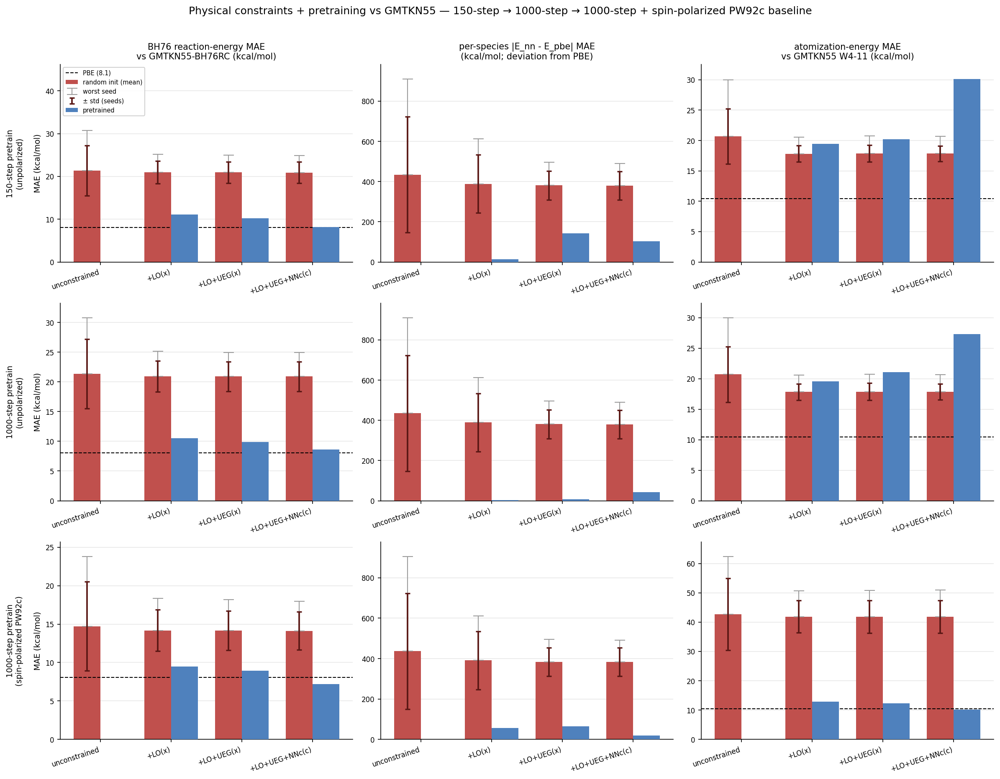

# Physical constraints + pretraining vs GMTKN55 — demo analysis

**Scope.** A small, self-contained demonstration (not a production benchmark) probing how three
ingredients pull a randomly-initialized `xcquinox.alec` GGA exchange–correlation network toward
correct physics: (i) **physical constraints**, (ii) **pretraining** to PBE/LDA enhancement factors,
and (iii) a **spin-polarized correlation baseline**. Settings: `def2-svp`, DFT grid level 1, a
single pretrain seed, 16 random-init seeds for the random bars. Evaluation sets: 6 GMTKN55-BH76RC
reactions, a per-species PBE-deviation diagnostic, and a small closed-shell GMTKN55 **W4-11**
atomization subset. Directional evidence about *mechanism*, not absolute accuracy.

**Figure.** Rows = pretraining scenario (150-step → 1000-step → 1000-step + spin-polarized PW92c
baseline); columns = metric.



PBE baselines: **BH76 = 8.08**, **W4-11 = 10.45** kcal/mol. The middle column is a *deviation from
PBE* diagnostic (no GMTKN55 absolute-energy reference exists for it) — not an absolute-accuracy
benchmark. The left and right columns are scored against real GMTKN55 reference values.

---

## Takeaways

**1. The metric can hide the entire constraint benefit.** On BH76 *reaction energies*, constraints
look useless — random-init mean barely moves (unconstrained 21.4 → fully-constrained 20.9 kcal/mol).
A balanced reaction (Σ coeff = 0) **cancels the systematic per-species XC error** that constraints
act on. Reaction-energy benchmarks alone systematically under-report the value of constraints.

**2. Constraints buy robustness, not mean accuracy.** On the non-cancelling per-species metric the
random-init *mean* improves only modestly (435 → 380), but the tails collapse:
- **worst-of-16-seeds: 910 → 490 kcal/mol (~1.9×)**
- **seed-to-seed std: 288 → 70 kcal/mol (~4.1×)**

Constraints make a randomly-initialized network **reliably reasonable instead of occasionally
catastrophic** — the real payoff is training stability and reproducibility.

**3. Lieb–Oxford + UEG are the variance-killers; non-negativity is a fine-tuner.** The std collapse
is staircase-like: +LO 288 → 144, +UEG 144 → 72 (each ~2×), +NNc essentially flat. The *exchange*
constraints do the heavy lifting on robustness.

**4. Headline physics result — the spin-polarized correlation baseline fixes atomization energies.**
Atomization energies are dominated by open-shell **atoms** (H, C, N, O, F), where spin polarization
ζ matters and does not cancel. With the unpolarized (ζ = 0) PW92c baseline the pretrained W4-11
error is stuck at **~27 kcal/mol — 2.6× worse than PBE — and more training does not fix it**
(150-step 30.1 → 1000-step 27.3). Switching to the ζ-resolved PW92c baseline drops the pretrained,
fully-constrained W4-11 error to **10.2 kcal/mol ≈ PBE (10.45)** — a 2.7× improvement that is a
*physical-correctness* fix, not a capacity or training-length fix. It also helps BH76 (random-init
mean 21.4 → 14.7).

**5. A correct baseline restores "more constraints → better" monotonicity.** With the wrong
(unpolarized) baseline, adding constraints made pretrained W4-11 *worse* and non-monotonic
(19.6 → 21.1 → 27.3). With the spin-polarized baseline it is cleanly monotonic and improving
(12.9 → 12.3 → **10.2**), and the fully-constrained pretrained model **beats PBE on BH76** (7.19 vs
8.08).

**6. A capacity-vs-grounding nuance.** The spin-polarized model is *worse at random init* on W4-11
(unconstrained 42.7 vs 20.7) — the extra ζ input is unconstrained noise before training — but far
better *after* pretraining (10.2 vs 27.3). Added physical expressiveness costs at initialization and
pays off only once trained.

**One-line summary.** *Constraints don't lower mean reaction-energy error (it cancels) — they cut
worst-case per-species error ~2× and seed variance ~4×; and getting the spin-polarized correlation
baseline right is what pulls pretrained atomization energies from 2.6× worse than PBE down onto PBE.*

---

## Data

### Metric 1 — BH76 reaction-energy MAE (kcal/mol, vs GMTKN55-BH76RC; PBE = 8.08)

*Unpolarized baseline (rows 1 & 2 — random init is identical; pretraining differs):*

| constraint level | random mean | worst-of-16 | std | pretrained (150) | pretrained (1000) |
|---|---|---|---|---|---|
| unconstrained   | 21.37 | 30.79 | 5.84 | — | — |
| +LO             | 20.94 | 25.18 | 2.63 | 11.09 | 10.55 |
| +LO+UEG         | 20.93 | 24.95 | 2.50 | 10.21 | 9.89 |
| +LO+UEG+NNc     | 20.90 | 24.91 | 2.47 | **8.21** | **8.61** |

*Spin-polarized baseline (row 3):*

| constraint level | random mean | worst-of-16 | std | pretrained (1000) |
|---|---|---|---|---|
| unconstrained   | 14.72 | 23.79 | 5.78 | — |
| +LO             | 14.17 | 18.36 | 2.68 | 9.46 |
| +LO+UEG         | 14.15 | 18.20 | 2.55 | 8.94 |
| +LO+UEG+NNc     | 14.12 | 17.96 | 2.48 | **7.19** |

### Metric 2 — per-species |E_nn − E_pbe| MAE (kcal/mol; deviation from PBE; lower = closer to PBE)

*Unpolarized baseline (rows 1 & 2):*

| constraint level | random mean | worst-of-16 | std | pretrained (150) | pretrained (1000) |
|---|---|---|---|---|---|
| unconstrained   | 434.85 | 910.10 | 287.83 | — | — |
| +LO             | 389.11 | 612.92 | 143.91 | 13.31 | 2.55 |
| +LO+UEG         | 381.07 | 495.26 | 71.73 | 142.24 | 7.20 |
| +LO+UEG+NNc     | 380.28 | 490.21 | 70.46 | 104.22 | 42.23 |

*Spin-polarized baseline (row 3):*

| constraint level | random mean | worst-of-16 | std | pretrained (1000) |
|---|---|---|---|---|
| unconstrained   | 436.44 | 905.03 | 286.83 | — |
| +LO             | 391.48 | 611.95 | 143.56 | 55.98 |
| +LO+UEG         | 383.52 | 494.73 | 71.24 | 64.72 |
| +LO+UEG+NNc     | 382.96 | 490.74 | 70.20 | **20.49** |

### Metric 3 — atomization-energy MAE (kcal/mol, vs GMTKN55 W4-11; PBE = 10.45)

*Unpolarized baseline (rows 1 & 2):*

| constraint level | random mean | worst-of-16 | std | pretrained (150) | pretrained (1000) |
|---|---|---|---|---|---|
| unconstrained   | 20.71 | 29.98 | 4.54 | — | — |
| +LO             | 17.83 | 20.56 | 1.35 | 19.44 | 19.59 |
| +LO+UEG         | 17.87 | 20.73 | 1.41 | 20.23 | 21.10 |
| +LO+UEG+NNc     | 17.85 | 20.66 | 1.29 | 30.12 | 27.27 |

*Spin-polarized baseline (row 3):*

| constraint level | random mean | worst-of-16 | std | pretrained (1000) |
|---|---|---|---|---|
| unconstrained   | 42.70 | 62.38 | 12.31 | — |
| +LO             | 41.89 | 50.69 | 5.48 | 12.94 |
| +LO+UEG         | 41.89 | 50.80 | 5.55 | 12.32 |
| +LO+UEG+NNc     | 41.87 | 50.89 | 5.56 | **10.20** |

---

## Reproduce

The figure is rebuilt from three saved run-logs with **no recomputation**:

```bash
python notebooks/analysis/make_constraint_3x3.py \
  notebooks/analysis/demo_logs/constraint_demo_pretrain150step.log \
  notebooks/analysis/demo_logs/constraint_demo_pretrain1000step.log \
  notebooks/analysis/demo_logs/constraint_demo_pretrain1000step_polc.log \
  notebooks/analysis/constraint_pretrain_gmtkn55_demo_3x3.png
```

To regenerate a run-log from scratch (~12 min for 150 steps, ~60 min for the 1000-step rows):
`python notebooks/analysis/constraint_pretrain_gmtkn55_demo.py`. The demo source defines the
constraint levels, metrics, and the spin-polarized baseline toggle.

**Caveat for presentation.** This is the demo configuration (small basis, coarse grid, single
pretrain seed, small reaction/atomization sets). It is directional evidence about the *mechanism*;
the cluster runs are the production test.
