# v7 cloning campaign: summary of the results to 2026-09-15

This is the short form of `REPORT_v7_2026-09-15` (the full report, 87 pages): the model
and its equations, the generation of the training subsets, the pre-training methodology and
results, and for the two optimization stages only the training losses, the trained
enhancement factors and the DFS-units 3x3 figures with their per-cell tables. The figure and
section numbers are those of the full report, so that a figure cited here can be found there
with its neighbours; the figures the summary leaves out are cited as "of the full report".
Every number is read from a file of the pulled runs or from a CSV the figure suite wrote
beside the figure it belongs to.

## Scope and inventory

The v7 campaign trains one network pair (an exchange network and a correlation network) per
architecture and per training-subset size, under one protocol, on the cluster as separate runs
that differ in their architecture axis. Each run carries its own pre-training (the cloning of
the parent functional), a fidelity certificate that gates its training array, and the array
itself, one cell per (architecture, subset size). The figures and tables are drawn once over
every finished cell of every run (the runs merged into one view, `family_runs.yaml`); the
architecture names are those of Sec. 1.5.

| Run | Architectures | Cells in the figures / planned | Run directory |
|---|---|---|---|
| size | deep_3x16, deep_attn_3x16, deep_2x8, deep_attn_2x8 | deep_3x16 11/11, deep_attn_3x16 10/11, deep_2x8 11/11, deep_attn_2x8 9/11 | `run_20260902T145245Z` |
| families | deep0_3x16, deep0_attn_3x16, deep0_cusp_3x16 | deep0_3x16 11/11, deep0_attn_3x16 8/11, deep0_cusp_3x16 0/11 | `run_20260902T145247Z` |
| meta-GGA families | deep0_cusp_mgga_3x16, deep0_mgga_3x16, deep0_mgga_attn_3x16, deep0_rung35_mgga_3x16, deep0_rung35ms_mgga_3x16 | 0/55 (four certificates read FAIL, Sec. 3.6; the fifth fit was cancelled) | `run_20260902T145250Z` |
| 25-cycle arm | deep_3x16, tag `[25 cycles]` | 2/5 (7 and 12) | `run_20260908T153856Z` |
| dpyscf-parity arm | deep_3x16, tag `[dpyscf parity]` | 2/5 (7 and 12) | `run_20260908T153908Z` |

The subset-size axis is 1, 2, 3, 4, 5, 6, 7, 12, 15, 18 and 26 training points, drawn from
the 26-point DFS training pool by the Jensen-Shannon subset selection of Sec. 2. Basis
6-311++G(3df,2pd), grid level 3, density fitting on, for every stage. The validation-best
checkpoint is read for every optimization figure. The figures and tables hold 64 cells; the
cells not among them are running or queued (deep_attn_3x16 at 26, stopped by the 48 h wall
and relaunched from its resume checkpoint; deep_attn_2x8 at 26; deep0_attn_3x16 at 15, 18 and
26; deep0_cusp_3x16 at every size; the arms at 15 to 26), held (the meta-GGA group), or
evaluated with held-out tables holding no reaction (deep_attn_2x8 at 18 and deep_3x16
[25 cycles] at 15: every benchmark reference was refused while the T1 backfill was rewriting
the reference files, Sec. 5.8; both are to be re-evaluated in a later cluster session).

## 1. Model, descriptors and the functional form

Sources: `xcquinox/pipeline/networks.py` (the two networks), `xcquinox/pipeline/descriptors.py` and
`xcquinox/pipeline/metagga.py` (the extra descriptors), `xcquinox/net.py` (the attention block),
`xcquinox/pipeline/config.py` (the architecture registry). The coordinate convention is the DFS one
(`model.descriptor_coordinates: dfs` in every v7 file), following Dick and Fernandez-Serra,
PRB 104, L161109 (2021), whose equation numbers are quoted as "DFS Eq. n".

### 1.1 Density variables

With $n = n_\alpha + n_\beta$ the total density and $\sigma = |\nabla n|^2$,

$$
k_F = (3\pi^2 n)^{1/3}, \qquad
s = \frac{|\nabla n|}{2 k_F n}, \qquad
r_s = \left(\frac{3}{4\pi n}\right)^{1/3}, \qquad
\zeta = \frac{n_\alpha - n_\beta}{n}, \qquad
\phi(\zeta) = \tfrac12\left[(1+\zeta)^{4/3} + (1-\zeta)^{4/3}\right].
$$

$s$ is the reduced density gradient (DFS Eq. 5), $\phi$ the spin-scaling factor of DFS Eq. 4
($\phi = 1$ at $\zeta = 0$, $2^{1/3}$ at full polarization). The density is floored at the
network's `lower_rho_cutoff` before any of these is formed.

### 1.2 Network coordinates (DFS coordinates)

The exchange network reads one coordinate at the GGA level and two at the meta-GGA level; the
correlation network reads three and four. They are logarithmic compressions of the variables
above (DFS Eqs. 7 to 10):

$$
x_0 = \ln\!\left(n^{1/3} + 10^{-5}\right), \qquad
x_1 = \ln \phi(\zeta), \qquad
x_s = \left(1 - e^{-s^2}\right)\ln(s + 1), \qquad
x_\alpha = \ln\frac{\alpha + 1}{2}.
$$

Exchange input: $[x_s, \ldots]$, where $s$ is that of the doubled spin channel $2 n_\sigma$ (the
exchange network is evaluated per spin channel, Sec. 1.4). Correlation input:
$[x_0, x_1, x_s, \ldots]$ on the total density. The ellipsis holds the extra descriptors of the
architecture, in the registry's list order; on the meta-GGA rung the raw $\alpha$ column among
them is replaced by $x_\alpha$.

### 1.3 Extra descriptors

**Iso-orbital indicator (meta-GGA rung, `metagga`)**, SCAN's $\alpha$ (Sun, Ruzsinszky and
Perdew, PRL 115, 036402 (2015), Eq. 2; DFS Eq. 6):

$$
\alpha = \frac{\tau - \tau_W}{\tau_{\rm unif}}, \qquad
\tau = \tfrac12 \sum_i |\nabla\psi_i|^2 = \tfrac12 \sum_{\mu\nu} P_{\mu\nu}\, \nabla\chi_\mu\cdot\nabla\chi_\nu, \qquad
\tau_W = \frac{|\nabla n|^2}{8n}, \qquad
\tau_{\rm unif} = \tfrac{3}{10}(3\pi^2)^{2/3} n^{5/3}.
$$

$\tau$ is a contraction of the live one-particle density matrix $P$ against the AO gradients,
so it is self-consistent and differentiable through the SCF without second derivatives. The
bound $\alpha \ge 0$ (the von Weizsacker inequality) is imposed by a smooth positive part rather
than a hard clip, so the descriptor and its derivative stay continuous where a spin channel holds
one orbital.

**Nuclear cusp pair (`cusp`)**, two bounded features per grid point:

$$
x_4 = \exp(-2 Z_{\rm nearest}\, r_{\min}), \qquad
x_5 = \tanh\!\left(\frac{1}{5}\ln \sum_A \frac{Z_A}{r_A}\right).
$$

$x_4$ is a proximity feature following the density-form cusp envelope $e^{-2Zr}$ (Steiner, J.
Chem. Phys. 39, 2365 (1963), the density counterpart of Kato's wavefunction cusp); $x_5$ is the
log-compressed bare-nuclear potential $-V_{\rm ext}$, the log and the $1/5$ scale being the
conditioning of this work. Both are geometric, so the synthetic pre-training mesh (Sec. 3.1)
carries no values for them.

The remaining registry descriptors (density-matrix statistics, the rung-3.5 occupancies) are
not on any v7 axis and are not described here.

### 1.4 The functional form

Each network is a multilayer perceptron with GELU activations, `depth` hidden layers of `nodes`
units, a final linear layer (initialized at zero in the `deep_*` family,
`zero_init_final_layer`), and an output squash.
With $g$ the MLP output at a grid point,

$$
F_x = 1 + \mathcal{L}_{1.804}\!\left(G_x \cdot g_x\right), \qquad
F_c = 1 + \mathcal{L}_{2}\!\left(G_c \cdot g_c\right), \qquad
\mathcal{L}_{\lambda}(z) = \lambda\,\mathrm{sigmoid}\!\left(z - \ln(\lambda - 1)\right) - 1.
$$

$\mathcal{L}_\lambda(0) = 0$, so a zero MLP output returns $F = 1$ (the local density
approximation), and $F$ stays in $(0, \lambda)$ for every $z$. $\mathcal{L}_\lambda$ is the
DFS $I_a$ map (DFS Eq. 11) to machine precision. For exchange $\lambda = 1.804 = 1 +
\kappa_{\rm PBE}$, the PBE Lieb-Oxford-motivated ceiling (PBE, PRL 77, 3865 (1996), Eq. 14);
DFS uses 1.174 (the tighter bound of Perdew, Ruzsinszky, Sun and Burke, J. Chem. Phys. 140,
18A533 (2014)), and the v7 meta-GGA architectures keep 1.804 as well
(`config.resolved_xnet_lob_lim`), a recorded deviation. For correlation $\lambda = 2$ is the
symmetric sigmoid of DFS Eq. 13; its purpose is $F_c \ge 0$, the upper value 2 is incidental.

$G$ is the uniform-electron-gas gate that pins $F = 1$ where the gradient vanishes:

$$
G = \tanh^2(s) \ \ \text{(GGA rung)}, \qquad
G = x_s + \tanh^2(x_\alpha) \ \ \text{(meta-GGA rung, DFS Eq. 12)},
$$

evaluated on the raw $s$ (and $\alpha$), never on the compressed coordinate. On the meta-GGA
rung the same gate form is used for both networks (DFS's correlation gate applies $\tanh$ to
$x_s$; recorded deviation).

The exchange-correlation energy is assembled with the exchange spin-scaling relation of
Oliver and Perdew (PRA 20, 397 (1979)) and the PW92 correlation baseline:

$$
E_{xc} = \tfrac12\left(E_x[2 n_\alpha] + E_x[2 n_\beta]\right) + E_c[n_\alpha, n_\beta], \qquad
E_x[n] = \int n\, \epsilon_x^{\rm LDA}(n)\, F_x\, d^3r, \qquad
E_c = \int n\, \epsilon_c^{\rm PW92}(r_s, \zeta)\, F_c\, d^3r,
$$

so the exchange network sees each spin channel at its doubled density (its $x_s$ is that of
$2 n_\sigma$), and the correlation network sees the total density with $\zeta$ through $x_1$.

**Attention variants.** In the `_attn` architectures a self-attention block (Vaswani et al.,
2017, Eqs. 1 and 2, pre-layer-norm as in Xiong et al., 2020) sits after the first hidden layer.
The hidden vector of $H$ units at a grid point is treated as $h$ tokens of dimension $d_k = H/h$
and attention runs across the token axis,

$$
\mathrm{Attn}(Q, K, V) = \mathrm{softmax}\!\left(\frac{QK^{\top}}{\sqrt{d_k}}\right) V, \qquad
x \leftarrow x + W^{O}\,\mathrm{Concat}(\mathrm{head}_1, \ldots, \mathrm{head}_h)(\mathrm{LN}(x)).
$$

It is a per-point re-mixing of hidden units, not a spatial or non-local operation.

### 1.5 Architectures on the v7 axes

The architectures lie on four axes: the size (hidden layers x units), the initialization of
the last layer, attention, and the extra descriptors (which set the rung and the parent). The
name states them: the family word is the initialization (`deep` for the Glorot start of every
layer; `deep0` for a last layer whose weight and bias are zeroed at construction, so that the
untrained network is the LDA, $F = 1$, and pre-training starts from it), then the descriptor
and attention tokens, then the size. `deep_3x16` and `deep0_3x16` are the same network (depth 3,
width 16, the same inputs, the same parameter count), separated by
the initialization alone, so the two columns are replicates of one architecture under two
starts. Nothing is frozen and nothing is appended in either; after pre-training both are PBE
clones that differ in their fitted weights.

| Architecture | Start | Rung, parent | Layers x units | Heads | Extra descriptors |
|---|---|---|---|---|---|
| deep_2x8 | Glorot | GGA, PBE | 2 x 8 | none | none |
| deep_attn_2x8 | Glorot | GGA, PBE | 2 x 8 | 2 | none |
| deep_3x16 | Glorot | GGA, PBE | 3 x 16 | none | none |
| deep_attn_3x16 | Glorot | GGA, PBE | 3 x 16 | 4 | none |
| deep0_3x16 | last layer zeroed | GGA, PBE | 3 x 16 | none | none |
| deep0_attn_3x16 | last layer zeroed | GGA, PBE | 3 x 16 | 4 | none |
| deep0_cusp_3x16 | last layer zeroed | GGA, PBE | 3 x 16 | none | cusp |
| deep0_mgga_3x16 | last layer zeroed | meta-GGA, SCAN | 3 x 16 | none | $\alpha$ |
| deep0_mgga_attn_3x16 | last layer zeroed | meta-GGA, SCAN | 3 x 16 | 4 | $\alpha$ |
| deep0_cusp_mgga_3x16 | last layer zeroed | meta-GGA, SCAN | 3 x 16 | none | cusp, $\alpha$ |
| deep0_rung35_mgga_3x16 | last layer zeroed | meta-GGA, SCAN | 3 x 16 | none | cusp, rung-3.5 occupancy, $\alpha$ |
| deep0_rung35ms_mgga_3x16 | last layer zeroed | meta-GGA, SCAN | 3 x 16 | none | cusp, rung-3.5 multishell occupancy, $\alpha$ |

The network inputs follow from the rung and the extra descriptors:

| Architecture | Exchange input | Correlation input |
|---|---|---|
| deep_2x8, deep_attn_2x8, deep_3x16, deep_attn_3x16, deep0_3x16, deep0_attn_3x16 | $x_s$ | $x_0, x_1, x_s$ |
| deep0_cusp_3x16 | $x_s, x_4, x_5$ | $x_0, x_1, x_s, x_4, x_5$ |
| deep0_mgga_3x16, deep0_mgga_attn_3x16 | $x_s, x_\alpha$ | $x_0, x_1, x_s, x_\alpha$ |
| deep0_cusp_mgga_3x16 | $x_s, x_4, x_5, x_\alpha$ | $x_0, x_1, x_s, x_4, x_5, x_\alpha$ |
| deep0_rung35_mgga_3x16, deep0_rung35ms_mgga_3x16 | $x_s, x_4, x_5, x_\alpha$ and the occupancy columns (two; six in the multishell form) | $x_0, x_1, x_s, x_4, x_5, x_\alpha$ and the same occupancy columns |

The `deep0` networks also carry `dm_entropy_intensive` and
`descriptor_log_transform`, both inert on this axis (no density-matrix descriptor; the DFS
coordinates already compress $s$, and only the cusp column-1 logarithm acts). All v7 networks
are unanchored (`model.parent_anchor: false`): the network output is the whole enhancement
factor, and the parent functional enters only as the pre-training target. A cell of a run
trained under another protocol carries the run's tag on its name (`deep_3x16 [25 cycles]`,
`deep_3x16 [dpyscf parity]`; Sec. 6), so that the same architecture under two protocols sits
on one axis.

## 2. Training-subset generation (step 0 of the pipeline)

Sources: `xcquinox/pipeline/dfs_pool.py` (the pool), `xcquinox/pipeline/training_points.py`
(`build_dfs_pool_points`), `xcquinox/pipeline/subset_selection.py` (the descriptors, the histograms,
the metric, the search), the selection ledger
`notebooks/checkpoints_step7/alpha_on/subset_index_log.json`, the cached per-species descriptors
`notebooks/checkpoints_step7/subset_descriptors/` and the cached reference histogram
`notebooks/checkpoints_step7/alpha_on/dfs_pool_full_hist/reference.npz`. Every value quoted below
was recomputed from those caches with the package's own functions and agrees with the ledger to
the last digit.

### 2.1 The pool

The training pool is the DFS training set (Dick and Fernandez-Serra, PRB 104, L161109 (2021),
SI Sec. II): 21 atomization energies of G2/97 molecules, 3 BH76 reactions and 2 IP13 ionization
potentials, 26 selectable points, with the H and Li atomic densities of the DFS set entering as
the anchors of the points that contain those elements. The atomization references are the
non-relativistic, zero-point-exclusive values of Haunschild and Klopper (J. Chem. Phys. 136,
164102 (2012)) with H2O and C2H2 from W4-11 (Karton, Daon and Martin, CPL 510, 165 (2011)); the
reaction energies are the GMTKN55 BH76RC values; the ionization potentials the NIST values. Each
point carries the species its loss term needs: an atomization point its molecule plus the H and
Li anchors it contains, a reaction point every reactant and product, an ionization point the
neutral and the cation. The 26 points, in the index order of the ledger:

| Index | Point | Kind | Species (name, charge, spin) |
|---|---|---|---|
| 0 | H2 | atomization energy | H2 (0, 0), H (0, 1) |
| 1 | N2 | atomization energy | N2 (0, 0) |
| 2 | FLi | atomization energy | FLi (0, 0), Li (0, 1) |
| 3 | CHN | atomization energy | CHN (0, 0), H (0, 1) |
| 4 | CO2 | atomization energy | CO2 (0, 0) |
| 5 | F2 | atomization energy | F2 (0, 0) |
| 6 | C2H2 | atomization energy | C2H2 (0, 0), H (0, 1) |
| 7 | CO | atomization energy | CO (0, 0) |
| 8 | HLi | atomization energy | HLi (0, 0), H (0, 1), Li (0, 1) |
| 9 | Na2 | atomization energy | Na2 (0, 0) |
| 10 | NO | atomization energy | NO (0, 1) |
| 11 | CH | atomization energy | CH (0, 1), H (0, 1) |
| 12 | HO | atomization energy | HO (0, 1), H (0, 1) |
| 13 | NO2 | atomization energy | NO2 (0, 1) |
| 14 | HN | atomization energy | HN (0, 2), H (0, 1) |
| 15 | O3 | atomization energy | O3 (0, 0) |
| 16 | N2O | atomization energy | N2O (0, 0) |
| 17 | CH3 | atomization energy | CH3 (0, 1), H (0, 1) |
| 18 | CH2 | atomization energy | CH2 (0, 2), H (0, 1) |
| 19 | H2O | atomization energy | H2O (0, 0), H (0, 1) |
| 20 | H3N | atomization energy | H3N (0, 0), H (0, 1) |
| 21 | OH+N2_to_H+N2O | reaction energy | HO (0, 1), N2 (0, 0), H (0, 1), N2O (0, 0) |
| 22 | OH+CH3_to_O+CH4 | reaction energy | HO (0, 1), CH3 (0, 1), O (0, 2), CH4 (0, 0), H (0, 1) |
| 23 | HF+F_to_H+F2 | reaction energy | HF (0, 0), F (0, 1), H (0, 1), F2 (0, 0) |
| 24 | Li_IP | ionization potential | Li (0, 1), Li+ (1, 0) |
| 25 | C_IP | ionization potential | C (0, 2), C+ (1, 1) |

### 2.2 The descriptor distributions

For every unique species of the pool (30 with the anchors and the cations) one self-consistent
PBE calculation at def2-SVP on a level-1 quadrature grid gives, at every grid point $g$ with
quadrature weight $w_g$, the three descriptors

$$
\rho^{1/3}, \qquad
s = \frac{|\nabla \rho|}{2 (3\pi^2)^{1/3} \rho^{4/3}}, \qquad
\alpha = \frac{\tau - \tau_W}{\tau_{\rm unif}} \ \ \text{(clipped to } [0, 100]),
$$

with $\tau_W = |\nabla\rho|^2 / 8\rho$ and $\tau_{\rm unif} = \tfrac{3}{10}(3\pi^2)^{2/3}\rho^{5/3}$
as in Sec. 1.3. A point's descriptor sample is the concatenation of its species' grid points,
so a reaction contributes in proportion to the number of grid points of its species. The
reference distribution is the concatenation over all 26 points. For each descriptor $x \in
\{\rho^{1/3}, s, \alpha\}$ the reference sample is binned into 200 bins of equal width between
its 0.1 and 99.9 percentiles, weighted by the quadrature weights, and every candidate subset is
binned on the same edges:

$$
h_x^{(b)} = \sum_{g \,:\, x_g \in \text{bin } b} w_g, \qquad
P_x^{(b)} = \frac{h_x^{(b)}}{\sum_{b'} h_x^{(b')}} .
$$

The normalization to a probability mass function removes the bin width and the sample size, so
the comparison is between the shapes of the weighted distributions.

Two properties of these histograms follow from the linear edges and the percentile range and
are stated here because they determine what the metric measures. The ranges are set by the
low-density tail of the grids, where $s$ and $\alpha$ grow without bound: the $s$ edges run from
$8 \times 10^{-9}$ to $2.0 \times 10^{10}$ and the $\alpha$ edges from 0 to $2.6 \times 10^{10}$,
while the $\rho^{1/3}$ edges run from $10^{-10}$ to 9.04. With 200 bins of equal width, the
quadrature weights (which grow into the tail) place 98.1 percent of the reference mass in the
first $\rho^{1/3}$ bin, 88.9 percent in the first $s$ bin and 97.2 percent in the first
$\alpha$ bin; 99 percent of the mass lies within the first 2, 126 and 12 bins. What the first
bin holds differs between the descriptors. For $s$ and $\alpha$ it is the whole chemically
relevant range ($s = 5$ and $\alpha = 10$ both fall in bin 0, whose widths are $10^8$), so the
metric compares those two distributions over the remaining 11 and 3 percent of the weight,
which sits in the low-density tails of the molecular grids. For $\rho^{1/3}$ the first bin is
the vacuum tail itself ($\rho < 9.2 \times 10^{-5}$ per bohr$^3$), and the remaining 1.9 percent
of the weight is the valence and core region ($\rho = 0.01$ falls in bin 4, $\rho = 1$ in bin
22). Samples outside the edges enter no histogram: 1.92 percent of the pool weight for $s$ and
0.20 percent for $\alpha$. The $s$ marginal carries most of the divergence (Sec. 2.4).

### 2.3 The metric and the search

The distance between a candidate subset $S$ and the pool is the Jensen-Shannon divergence
(Lin, IEEE Trans. Inf. Theory 37, 145 (1991)) summed over the three marginals with equal
weights:

$$
\mathrm{JSD}(S) = \sum_{x \in \{\rho^{1/3},\, s,\, \alpha\}} \tfrac12 \left[ \mathrm{KL}(P_x \,\|\, M_x) + \mathrm{KL}(Q_x \,\|\, M_x) \right], \qquad
M_x = \tfrac12 (P_x + Q_x),
$$

$$
\mathrm{KL}(P \,\|\, Q) = \sum_b P^{(b)} \ln \frac{P^{(b)}}{Q^{(b)}},
$$

with $P_x$ the reference and $Q_x$ the subset mass function of descriptor $x$, probabilities
floored at $10^{-12}$ inside the logarithm, in nats. Each marginal term lies in $[0, \ln 2]$ and
the sum in $[0, 3\ln 2]$; a subset whose grid points all fall outside a marginal's range is
assigned an infinite divergence and never selected. For each subset size $r \in \{1, \ldots, 7,
12, 15, 18, 26\}$ the subset is the exhaustive minimizer of $\mathrm{JSD}(S)$ over all
$\binom{26}{r}$ combinations (9.7 million at $r = 12$), computed with the pre-binned per-point
histograms; the L2 distance between the same mass functions was run as a second metric and is
recorded in the ledger but not used by any v7 run. The subsets are nested only where the
minimizer happens to nest: the 7-molecule subset does not contain the 6-molecule one.

### 2.4 The chosen subsets

| r | Points (ledger index order) | AE / BH76 / IP | JSD to the pool | $\rho^{1/3}$ term | $s$ term | $\alpha$ term | $s$ share |
|---|---|---|---|---|---|---|---|
| 1 | H2O | 1 / 0 / 0 | 0.0475 | 0.00109 | 0.03764 | 0.00881 | 79% |
| 2 | HLi, OH+N2_to_H+N2O | 1 / 1 / 0 | 0.0284 | 0.00015 | 0.02372 | 0.00455 | 83% |
| 3 | OH+N2_to_H+N2O, OH+CH3_to_O+CH4, Li_IP | 0 / 2 / 1 | 0.0228 | 0.00017 | 0.01995 | 0.00267 | 88% |
| 4 | CH2, OH+N2_to_H+N2O, OH+CH3_to_O+CH4, Li_IP | 1 / 2 / 1 | 0.0203 | 0.00008 | 0.01801 | 0.00218 | 89% |
| 5 | HLi, OH+N2_to_H+N2O, OH+CH3_to_O+CH4, Li_IP, C_IP | 1 / 2 / 2 | 0.0163 | 0.00028 | 0.01418 | 0.00183 | 87% |
| 6 | HLi, CH, OH+N2_to_H+N2O, OH+CH3_to_O+CH4, Li_IP, C_IP | 2 / 2 / 2 | 0.0130 | 0.00021 | 0.01120 | 0.00156 | 86% |
| 7 | CHN, CO2, HLi, CH, OH+N2_to_H+N2O, Li_IP, C_IP | 4 / 1 / 2 | 0.0102 | 0.00027 | 0.00877 | 0.00120 | 86% |
| 12 | CO2, C2H2, CO, HLi, CH, NO2, CH2, OH+N2_to_H+N2O, OH+CH3_to_O+CH4, HF+F_to_H+F2, Li_IP, C_IP | 7 / 3 / 2 | 0.0034 | 0.00004 | 0.00292 | 0.00040 | 87% |
| 15 | FLi, CHN, CO2, C2H2, CO, HLi, NO, CH, NO2, CH2, OH+N2_to_H+N2O, OH+CH3_to_O+CH4, HF+F_to_H+F2, Li_IP, C_IP | 10 / 3 / 2 | 0.0010 | 0.00007 | 0.00081 | 0.00017 | 77% |
| 18 | N2, FLi, CHN, CO2, C2H2, CO, HLi, Na2, NO, CH, NO2, N2O, CH2, OH+N2_to_H+N2O, OH+CH3_to_O+CH4, HF+F_to_H+F2, Li_IP, C_IP | 13 / 3 / 2 | 0.0004 | 0.00003 | 0.00028 | 0.00007 | 74% |
| 26 | H2, N2, FLi, CHN, CO2, F2, C2H2, CO, HLi, Na2, NO, CH, HO, NO2, HN, O3, N2O, CH3, CH2, H2O, H3N, OH+N2_to_H+N2O, OH+CH3_to_O+CH4, HF+F_to_H+F2, Li_IP, C_IP | 21 / 3 / 2 | 0.0000 | 0.00000 | 0.00000 | 0.00000 | - |

**Fig. 2.1** Left: the Jensen-Shannon divergence of the chosen subset to the full pool against
the subset size, the total and its three marginal terms (log scale; the bound $3 \ln 2 = 2.08$
lies far above the axis). The divergence falls from 0.0475 at one molecule to 0.0102 at seven,
0.0034 at twelve, 0.0010 at fifteen and 0.0004 at eighteen, and to zero at the full pool; the
$s$ term is 74 to 89 percent of the total at every size (0.0376 of 0.0475 at one molecule,
0.00028 of 0.00038 at eighteen). Right, three panels: the mass functions
of the reference (black) and of the subsets at $r = 1$, 7 and 26 over the bin index, log scale,
with the first-bin mass printed in each panel.

## 3. Pre-training (functional cloning)

Sources: `xcquinox/pipeline/pretrain.py`, `xcquinox/pipeline/pretrain_data_gen.py`, the `pretrain:` and
`fidelity:` blocks of the resolved configurations, `pretrain/<arch>/pretrain_metadata.json` and
`pretrain/<arch>/fidelity_certificate.json` of each run.

### 3.1 Set, targets and objective

Each network is fitted to reproduce its parent functional's enhancement factor pointwise on the
parent's own self-consistent densities: PBE for the GGA rung, SCAN for the meta-GGA rung. The set
is the DFS pre-training inventory (8 free atoms and 23 G2/97 molecules at the GGA level; 22
molecules at the meta-GGA level, which drops H2) plus every single-atom species of the
BH76 and W4-11 pools at its production charge and spin (the 12 neutral elements and the F- and
Cl- anions), 39 systems for the GGA groups and 38 for the meta-GGA group (`n_systems` of the
certificates). The targets are stored per grid point as

$$
t_x = F_x^{\rm parent} - 1 = \frac{\epsilon_x^{\rm parent}}{\epsilon_x^{\rm LDA}} - 1, \qquad
t_c = F_c^{\rm parent} - 1 = \frac{\epsilon_c^{\rm parent}}{\epsilon_c^{\rm PW92}} - 1,
$$

from spin-resolved libxc evaluations, the exchange rows posed per spin channel at the doubled
density $(2 n_\sigma, 4\sigma_{\sigma\sigma})$, the footing the production exchange evaluates
(`exchange_footing: spin_channel`). A synthetic $(r_s, s, \alpha)$ mesh (the DFS SI's $(s,
\alpha)$ grid extended to three dimensions) is added as a regularizer at a fixed 30 percent share
of the integration weight (`mesh_fraction: 0.3`); its rows belong to no system.

The objective per network is the integration-weighted pointwise residual plus a per-system
energy term (`_PretrainLoss`):

$$
\begin{aligned}
\mathcal{L}_{\rm pre} = {} & \frac{\sum_i w_i\,(F_i^{\rm NN} - 1 - t_i)^2}{\sum_i w_i} \\
& + w_E\,\frac{1}{N_{\rm sys}}\sum_{s}\Big(\sum_{i\in s} w^{\rm grid}_i\, n_i\,\epsilon_i^{\rm LDA}\, F_i^{\rm NN} - E_{xc,s}^{\rm parent}\Big)^2,
\end{aligned}
$$

$$
w_i = |n_i\, \epsilon_i^{\rm LDA}|\, w_i^{\rm grid}, \qquad w_E = 0.1 .
$$

The energy term is present because the pointwise residual alone does not bound a system's
energy: in the earlier campaign the architecture with the lowest exchange residual carried the
largest atomization-energy offset from its parent. Schedule: Adam, 20000 steps, learning rate
$10^{-3}$ decaying linearly to $10^{-5}$ from the midpoint, gradient clip 1.0, a 20 percent
held-out validation slice scored every 50 steps with patience 300 checks (`pretrain:` block).

### 3.2 The fidelity certificate

After the fit, the saved networks are re-evaluated on every system of the set at the production
basis and grid and compared with the parent: the per-system exchange-correlation energy error
$\Delta E_{xc,s} = E_{xc,s}^{\rm NN} - E_{xc,s}^{\rm parent}$, and, for every molecule, the
atomization-energy error $\Delta AE = \Delta E_{xc,{\rm mol}} - \sum_A \Delta E_{xc,A}$ against
the parent's own atomization energy. The gate (`fidelity:` block, two-tier since 2026-09-02) is

$$
\max_{\rm atoms} |\Delta E_{xc,A}| \le 1.0\ \text{mHa}, \qquad
\mathrm{mean}_{\rm mol} |\Delta AE| \le 1.0\ \text{kcal/mol}, \qquad
\max_{\rm mol} |\Delta AE| \le 2.0\ \text{kcal/mol},
$$

and a failing certificate makes the pre-training task exit without success, which holds the
group's preflight and training array. The certificate is what gives the training-stage
comparison against PBE (or SCAN) its meaning: every trained cell starts from a network that is
its parent to within these tolerances.

### 3.3 Pre-training loss curves

**Fig. 3.1** The pointwise term of the objective per step taken, for the exchange network
(left) and the correlation network (right), one curve per architecture, log scale over the
20000 steps; the final value of each curve is printed in the legend. The regular spikes are
bursts of 5 to 14 consecutive steps at 6 to 12 times the local level, recurring every 420 to
590 steps from step 4000 to 8000 onward and ending near step 17500; they do not sit on the
50-step validation grid, and no snapshot is reloaded during a fit (the best network is kept
aside while training continues from the current weights), so their cause lies in the
optimization itself and is not established here. The first figure holds the seven certified
GGA clones of the size and families runs; the second the four meta-GGA clones whose fits
completed (their certificates failed, so they are not in the merged view and are drawn from
their run; the fifth fit, deep0_mgga_attn_3x16, was cancelled before it wrote a network pair).

The exchange curves of the four Glorot-start architectures reach $5.4 \times 10^{-8}$
(deep_2x8), $7.6 \times 10^{-8}$ (deep_attn_2x8), $6.4 \times 10^{-8}$ (deep_3x16) and
$1.5 \times 10^{-8}$ (deep_attn_3x16), the correlation curves $3.3 \times 10^{-6}$,
$3.8 \times 10^{-7}$, $7.6 \times 10^{-7}$ and $6.7 \times 10^{-8}$ in the same order;
deep_attn_3x16 descends earliest and ends lowest on both networks, and the deep_2x8
correlation network ends highest of the seven. Of the zero-init architectures deep0_attn_3x16
is lowest on both networks ($1.5 \times 10^{-8}$, $1.0 \times 10^{-7}$), deep0_3x16 and
deep0_cusp_3x16 within a factor 3.5 of each other ($2.8 \times 10^{-8}$ and
$9.5 \times 10^{-8}$; $3.4 \times 10^{-6}$ and $1.1 \times 10^{-6}$). The four meta-GGA clones
stop at $3.7 \times 10^{-6}$ (deep0_cusp_mgga_3x16), $3.8 \times 10^{-6}$
(deep0_rung35ms_mgga_3x16), $5.6 \times 10^{-6}$ (deep0_mgga_3x16) and $5.9 \times 10^{-6}$
(deep0_rung35_mgga_3x16) in exchange and at $5.2 \times 10^{-6}$, $1.2 \times 10^{-5}$,
$1.6 \times 10^{-5}$ and $1.05 \times 10^{-5}$ in correlation, 40 to 400 times above the GGA
clones in exchange and 1.5 to 240 times in correlation after the same 20000 steps, with smooth
trajectories and no divergence.

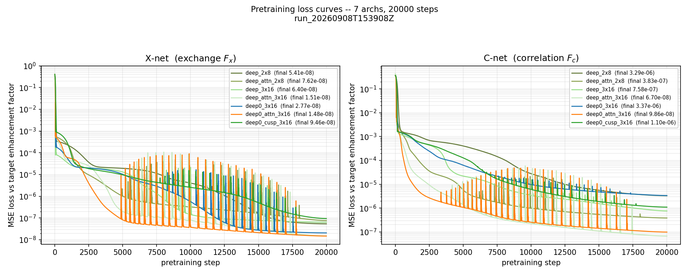

### 3.4 Certificate summary

The certificate-summary figure (Fig. 3.2 of the full report) is not repeated here; its numbers are in the table of Sec. 3.6.

### 3.5 Pre-trained enhancement factors

**Fig. 3.3** For one architecture, the pre-trained network against its parent along two slices
of descriptor space. Top left: the exchange enhancement factor $F_x(s)$ at density $n = 1$ and
zero extra descriptors, the parent dashed, the network solid, from $s = 0$ to 6. Top right: the
difference $F_x^{\rm NN} - F_x^{\rm parent}$ on the same slice, which is where the fit is
visible at all. Bottom left: the correlation factor $F_c(s; r_s)$ at $\zeta = 0$ for $r_s = 0.5$,
2 and 5, parent dashed and network solid; bottom right: the three differences. For the meta-GGA
clones the layout is three columns: $F_x(s; \alpha)$ at $\alpha = 0$ and $\alpha = 1$ (the SCAN
Fig. 1 convention, $\alpha$ the exact iso-orbital indicator of the slice) and $F_c$ at the same
two $\alpha$ values, each with its difference panel. The footer of each figure names the run,
the slices, the largest $|\Delta F_x|$ on the slice and the certificate verdict.

deep_3x16: $|\Delta F_x| \le 7 \times 10^{-3}$ over $s \le 6$, a smooth negative deviation growing
beyond $s = 4$ (the region the pre-training set barely samples), $|\Delta F_c| \le 4.5 \times
10^{-3}$ with oscillations below $s = 1.5$ at every $r_s$. deep_attn_3x16: $|\Delta F_x| \le 6
\times 10^{-3}$, $|\Delta F_c| \le 10^{-2}$ with one dip at $s = 2$, $r_s = 0.5$. deep0_3x16:
$|\Delta F_x| \le 2.6 \times 10^{-3}$ (the tightest exchange clone of the three shown),
$|\Delta F_c| \le 1.2 \times 10^{-2}$ at $r_s = 0.5$ and 5. The 2x8 pair (the fourth and fifth
figures): deep_2x8 has $|\Delta F_x| \le 4.9 \times 10^{-3}$, a positive bump of $+0.0024$ at
$s = 2$ and a negative deviation beyond $s = 2.5$ with its minimum $-0.0049$ at $s = 3.6$, and
$|\Delta F_c| \le 1.2 \times 10^{-2}$ ($r_s = 0.5$, a bump peaking at $s = 1.75$; $2.8 \times
10^{-3}$ at $r_s = 2$, $8.5 \times 10^{-3}$ at $r_s = 5$, with oscillations below $s = 1.5$);
deep_attn_2x8 has $|\Delta F_x| \le 1.5 \times 10^{-2}$, the deviation growing negative beyond
$s = 4$ to $-0.015$ at $s = 6$ (the largest exchange miss of the seven GGA clones, in the
region the set barely samples), and $|\Delta F_c| \le 5.7 \times 10^{-3}$ (a peak at $s = 0.65$,
$r_s = 5$; $4.6 \times 10^{-3}$ at $r_s = 0.5$, $2.3 \times 10^{-3}$ at $r_s = 2$).

The meta-GGA clones against SCAN (the last four figures). deep0_cusp_mgga_3x16:
$F_x$ at $\alpha = 0$ runs 0.005 below SCAN up to $s = 1$ and 0.01 to 0.027 above it for
$s > 2.5$ (the maximum at $s = 4.4$), and $F_x$ at $\alpha = 1$ 0.004 to 0.013 below it
between $s = 1$ and 4; $F_c$ at $\alpha = 1$, $r_s = 0.5$ has a spike of $+0.04$ near
$s = 0.2$, a dip of $-0.016$ at $s = 0.8$ and sits 0.006 to 0.033 below SCAN from $s = 2$
onward; at $\alpha = 0$ the correlation differences stay within $\pm 0.02$. deep0_mgga_3x16 is
the tightest of the four on the slices ($|\Delta F_x| \le 1.0 \times 10^{-2}$: at $\alpha = 0$
$-0.003$ below $s = 1$, $+0.003$ at $s = 1.3$ and 3.7 and a fall to $-0.010$ at $s = 6$; at
$\alpha = 1$ a dip of $-0.008$ at $s = 0.8$; $F_c$ within $\pm 0.006$ at $\alpha = 0$ and, at
$\alpha = 1$, spikes of $+0.024$ at $s = 0.2$ for $r_s = 0.5$ and $-0.023$ at $s = 0.7$ for
$r_s = 5$) and still fails on the atoms by 4.1 mHa (N): the certificate is decided on the
production densities, not on these slices. deep0_rung35_mgga_3x16: $|\Delta F_x| \le 5.0
\times 10^{-2}$, the exchange running from $-0.028$ at $s = 0$ through zero near $s = 1.5$ to
$+0.050$ at $s = 6$ at $\alpha = 0$ and from $-0.016$ at $s = 1$ to $+0.034$ at $s = 6$ at
$\alpha = 1$; $F_c$ at $\alpha = 0$ sits above SCAN at every $s$ for $r_s = 0.5$ (by $+0.061$
at $s = 0.1$, $+0.002$ at $s = 0.8$) and dips to $-0.035$ and $-0.038$ near $s = 0.9$ at
$r_s = 2$ and 5, and at $\alpha = 1$ has a peak of $+0.21$ at $s = 0.6$ ($r_s = 0.5$) and
$-0.07$ at $s = 0.75$ ($r_s = 5$). deep0_rung35ms_mgga_3x16: $|\Delta F_x| \le 3.3 \times
10^{-2}$ (from $-0.033$ at $s = 0$ to $-0.007$ at $s = 1$ at $\alpha = 0$, then rising to
$+0.029$ at $s = 6$; within $+0.01$ at $\alpha = 1$) and the largest correlation misses of any
clone: $-0.32$ to $-0.39$ at small $s$ at $\alpha = 0$ for every $r_s$ (the minima at $s = 0$,
0 and 1.3 for $r_s = 0.5$, 2 and 5), and at $\alpha = 1$ $+0.15$ at $s = 0.9$ ($r_s = 0.5$)
and $-0.18$ at $s = 0.85$ ($r_s = 5$). These are
systematic, same-sign offsets over wide ranges of $s$, which is the shape of error that does not
cancel between a molecule and its atoms (Sec. 3.6).

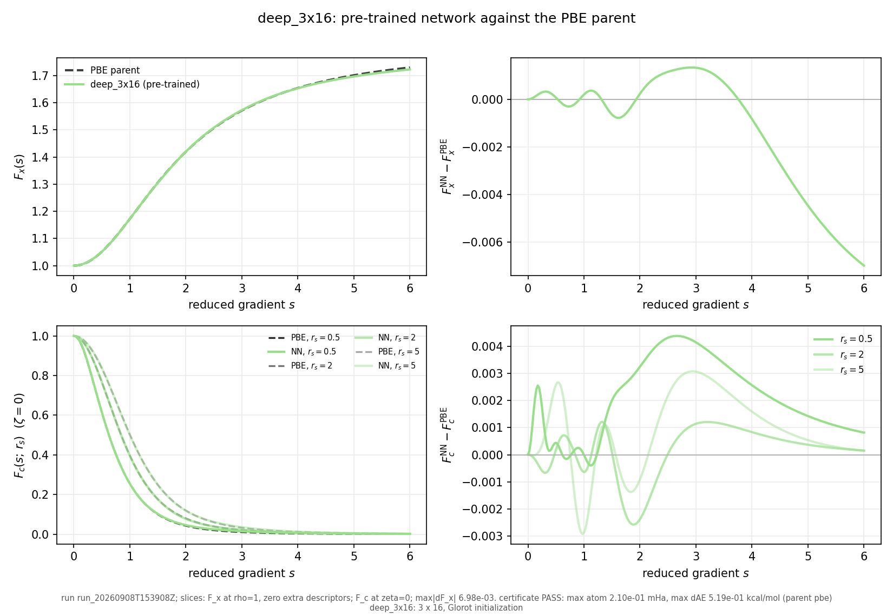

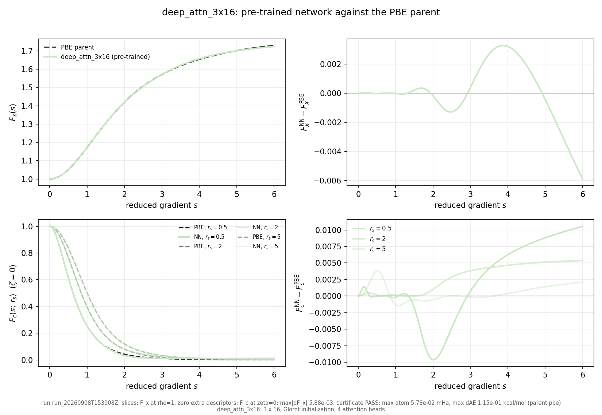

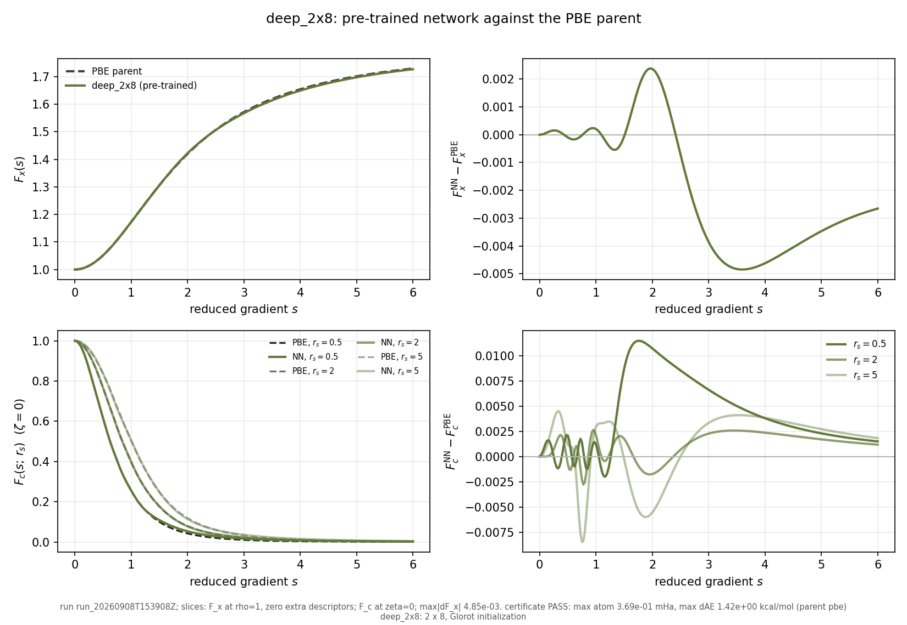

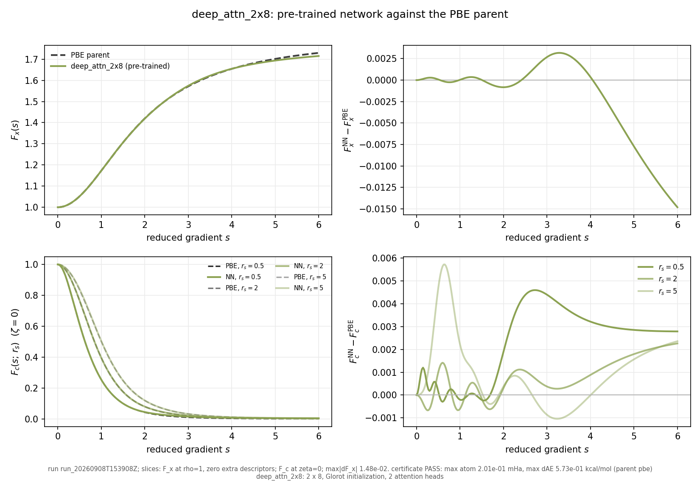

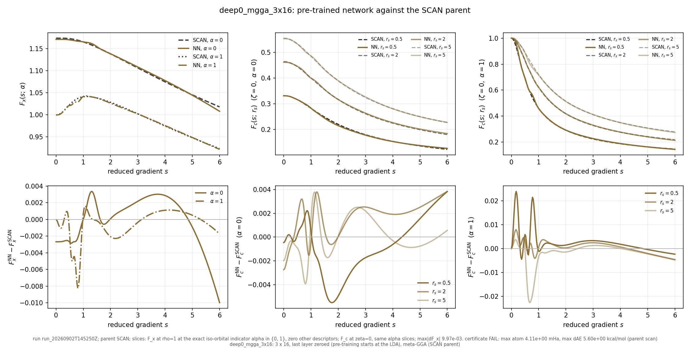

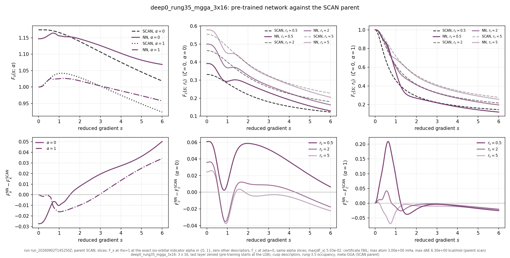

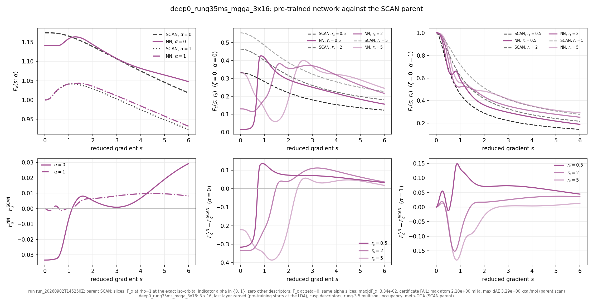

**Fig. 3.4** The exchange differences (left) and the correlation differences at $r_s = 2$
(right) of every certified GGA clone on one pair of axes. The four Glorot-start exchange
clones agree with PBE to $1 \times 10^{-3}$ below $s = 1.5$ and to $2.5 \times 10^{-3}$ below
$s = 2.5$ (deep_2x8 $+0.0024$ at $s = 2$) and fan out beyond it (deep_attn_3x16 to $+0.003$
at $s = 3.9$, deep_attn_2x8 to $+0.003$ at $s = 3.3$, deep_2x8 to $-0.0049$ at $s = 3.6$; at
$s = 6$ deep_3x16 $-0.007$, deep_attn_3x16 $-0.006$, deep_2x8 $-0.0027$ and deep_attn_2x8
$-0.015$, the largest miss on the slice); their correlation clones stay within $3 \times
10^{-3}$ below $s = 3$, deep_attn_3x16 drifting to $+5 \times 10^{-3}$ by $s = 6$ and the 2x8
pair to $+1.2 \times 10^{-3}$ and $+2.3 \times 10^{-3}$. The three zero-init clones stay within
$4.2 \times 10^{-3}$ everywhere on both slices (deep0_attn_3x16 exchange $+0.0034$ at
$s = 4.2$; deep0_cusp_3x16 correlation $+0.0041$ at $s = 3.2$).

The deep0_attn_3x16 and deep0_cusp_3x16 clones are drawn in the same
directories (`pretrain_fx_fc_<arch>.png`).

### 3.6 Certificate results

Read from `pretrain/<arch>/fidelity_certificate.json` and `pretrain_metadata.json`; the
pointwise losses are the saved network's, in units of the squared enhancement-factor residual.

Every GGA clone passes on all three criteria; the two with a species above 1 kcal/mol
(deep_2x8: C3H8 and C4H6; deep0_cusp_3x16: AlCl3) pass on the mean and under the 2.0 kcal/mol
backstop. The attention variants are the tightest clones by every measure (deep_attn_3x16: max
atom 0.058 mHa, mean 0.031 kcal/mol; deep0_attn_3x16: 0.123 mHa, 0.042 kcal/mol), at the price
of the longest fits (about 28 h against 3.8 h for their plain twins, `duration_seconds`);
the 2x8 pair fits in 1.6 h (deep_2x8) and 3.6 h (deep_attn_2x8), and deep_2x8 is the loosest
GGA clone (mean 0.343 kcal/mol, max 1.421).

The four meta-GGA clones whose 20000-step fits completed all fail the certificate, every one
on the free atoms (the largest atom error 2.10 to 4.11 mHa against the 1.0 mHa tolerance:
deep0_mgga_3x16 4.11 on N, deep0_cusp_mgga_3x16 3.13 on O, deep0_rung35_mgga_3x16 3.00 on O,
deep0_rung35ms_mgga_3x16 2.10 on Be) and three of the four on the mean atomization error as
well (1.47 to 2.06 kcal/mol against 1.0); deep0_rung35ms_mgga_3x16 is the one clone under the
1.0 kcal/mol mean (0.710) and fails on the atoms and, with AlCl3 at 3.29 kcal/mol, on the 2.0
kcal/mol backstop. Their pointwise residuals (3.7e-6 to 5.9e-6 in exchange, 5.2e-6 to 1.6e-5
in correlation) are one to two orders of magnitude above the GGA clones'. deep0_cusp_mgga_3x16
misses the most on the atomizations: the mean 2.06 kcal/mol, the largest 7.26 (C4H6; C3H8
7.19, O2 4.77, SiCH6 3.52, CH4 3.47), 14 of 22 molecules above 1 kcal/mol, every one of its
eight largest errors of the same sign; deep0_mgga_3x16 (AlCl3 5.60, O2 4.34, N2 3.61, 11 of 22
above 1) and deep0_rung35_mgga_3x16 (O2 6.30, AlCl3 4.84, Na2 3.71, 11 of 22) carry errors of
both signs among their largest. Fig. 3.3 of the full report shows where the clones miss SCAN:
same-sign offsets over wide ranges of $s$ (the $\alpha = 0$ exchange slice of
deep0_cusp_mgga_3x16 0.015 to 0.027 above SCAN for $s > 2$, the rung-3.5 clones' correlation
slices off by 0.06 to 0.39 below $s = 1$), which do not cancel between a molecule and its
atoms; deep0_mgga_3x16 sits within 0.01 of SCAN on every slice and fails on the atoms all the
same, so the slices are not where its miss lives. The v6 meta-GGA certificates, all PASS, were
fitted in the anchored model class (the network learns a correction on top of SCAN); these
are the first unanchored meta-GGA clones the two-tier gate has judged, and the rung rather
than one architecture is what fails. The fifth fit, deep0_mgga_attn_3x16, was cancelled
part-way (its directory holds the exchange network and the validation-best pair, no
correlation network and no curves). The meta-GGA training array is held; the follow-up is in
Sec. 6.

| Run | Architecture | Parent | Steps | Pointwise loss X / C | max atom $\lvert\Delta E_{xc}\rvert$ (mHa) | mean $\lvert\Delta AE\rvert$ (kcal/mol) | max $\lvert\Delta AE\rvert$ (kcal/mol) | Species over 1 kcal/mol | Verdict |
|---|---|---|---|---|---|---|---|---|---|
| size | deep_2x8 | PBE | 20000 | 5.41e-08 / 3.29e-06 | 0.369 | 0.343 | 1.421 | C3H8, C4H6 | PASS |
| size | deep_attn_2x8 | PBE | 20000 | 7.62e-08 / 3.83e-07 | 0.201 | 0.131 | 0.573 | none | PASS |
| size | deep_3x16 | PBE | 20000 | 6.40e-08 / 7.58e-07 | 0.210 | 0.162 | 0.519 | none | PASS |
| size | deep_attn_3x16 | PBE | 20000 | 1.51e-08 / 6.70e-08 | 0.058 | 0.031 | 0.115 | none | PASS |
| families | deep0_3x16 | PBE | 20000 | 2.77e-08 / 3.37e-06 | 0.439 | 0.114 | 0.450 | none | PASS |
| families | deep0_attn_3x16 | PBE | 20000 | 1.48e-08 / 9.86e-08 | 0.123 | 0.042 | 0.149 | none | PASS |
| families | deep0_cusp_3x16 | PBE | 20000 | 9.46e-08 / 1.10e-06 | 0.439 | 0.188 | 1.071 | AlCl3 | PASS |
| meta-GGA | deep0_mgga_3x16 | SCAN | 20000 | 5.61e-06 / 1.60e-05 | 4.106 | 1.473 | 5.605 | AlCl3, C3H8, C4H6, CH4, Cl2, H2O, HCN, HCl, LiF, N2, O2 | FAIL |
| meta-GGA | deep0_cusp_mgga_3x16 | SCAN | 20000 | 3.70e-06 / 5.18e-06 | 3.132 | 2.062 | 7.257 | AlCl3, C2H2, C3H8, C4H6, CH2, CH4, CO, CO2, F2, H2O, HCN, O2, PH3, SiCH6 | FAIL |
| meta-GGA | deep0_rung35_mgga_3x16 | SCAN | 20000 | 5.88e-06 / 1.05e-05 | 3.001 | 1.780 | 6.303 | AlCl3, C2H2, C3H8, C4H6, CO2, Cl2, F2, H2O, HCN, Na2, O2 | FAIL |
| meta-GGA | deep0_rung35ms_mgga_3x16 | SCAN | 20000 | 3.82e-06 / 1.20e-05 | 2.096 | 0.710 | 3.294 | AlCl3, CO2, H2O, O2 | FAIL |
| meta-GGA | deep0_mgga_attn_3x16 | SCAN | cancelled | -- | -- | -- | -- | -- | none |

## 4. Optimization, in-sample

Sources: `xcquinox/pipeline/losses.py` (`L5_gradnorm_vxc_step7`, the channel terms),
`xcquinox/pipeline/train.py` (the per-molecule loop, the optimizer), `xcquinox/pipeline/oneshot.py`
(the SCF tail window), `xcquinox/pipeline/solver_manual.py` (the differentiable SCF), the
`hyperparams:` and `solvers:` blocks of the resolved configurations, and per cell
`train_metadata.json`, `losses.npy`, `aux_log.pkl`, `eval/per_molecule.json`.

### 4.1 Training protocol

Each cell trains the certified clone of its architecture on a subset of the 26-point DFS pool.
The per-molecule update scheme takes one optimizer step per training group (a reaction, or a
molecule with its density and potential references) per epoch, so an epoch is one pass over
the groups. The loss of a group is the fixed weighted sum

$$
\mathcal{L} = 1\cdot\mathcal{L}_{AE} + 1\cdot\mathcal{L}_{\rm rxn} + 1\cdot\mathcal{L}_{IP} + 1\cdot\mathcal{L}_{v_{xc}} + 20\cdot\mathcal{L}_{\rho},
$$

the Letter's $\lambda_{RE} = 1$, $\lambda_n = 20$ structure (`effective_channel_weights`; the
GradNorm balancer is configured but dormant under this scheme, and the `vxc_weight` 0.01 and
`density_weight` 0.1 pre-scales are forced to 1). The channels, with $E^{\rm NN}$ the
self-consistent total energy of the 3-cycle SCF (Sec. 4.2) and $t = 0, \ldots, N-1$ the cycle
index:

* Reaction energies (`ae_as_reactions: true` routes the W4-11 atomizations here as
  molecule-to-atoms reactions with the network's own atoms, beside the BH76 barriers):
  $$
  \mathcal{L}_{\rm rxn} = \frac{1}{|T|}\sum_{t\in T} w_t^2\, r_t^2, \qquad
  r_t = \sum_i c_i\, E^{\rm NN}_{i,t} - E^{\rm ref}, \qquad
  w_t = \left(\frac{t}{N-1}\right)^2,
  $$
  $T$ the kept SCF tail (the last $\min(N, 10)$ cycles; at $N = 3$ all three, $w_t^2 = 0,
  1/16, 1$), the DFS convergence-tail scoring (DFS Eqs. 15 and 16) that penalizes a
  non-converging SCF instead of one arbitrary final cycle. Absolute Ha$^2$ (`loss_metric:
  absolute`). References: W4-11 atomization energies and the W2-F12 BH76 barrier heights of
  GMTKN55.
* Atom anchors (the residue of the AE channel once the atomizations are reactions): the free
  atoms of the subset are held near their exact non-relativistic energies $E_Z^{\rm anchor}$
  (Chakravorty et al., PRA 47, 3649 (1993)),
  $\mathcal{L}_{AE} = 0.01\cdot\mathrm{mean}_Z\, (E_Z^{\rm NN} - E_Z^{\rm anchor})^2 / (E_Z^{\rm anchor})^2$.
* Ionization potentials, $\mathcal{L}_{IP} = \mathrm{mean}\,(E^{\rm NN}_{+} - E^{\rm NN}_0 - IP^{\rm ref})^2$,
  present in the form but empty on every v7 subset (no IP13 point is selected).
* Exchange-correlation potential, on the reference density (frozen features):
  $\mathcal{L}_{v_{xc}} = \|V_{xc}^{\rm NN} - V_{xc}^{\rm ref}\|_F^2 / n_{\rm AO}^2$, summed over
  spin channels for open shells.
* Density, the final mixed density of the SCF against the CCSD reference density on the same
  grid, per electron squared (the Letter's Eq. 17 normalization; `density_per_electron: true`):
  $$
  \mathcal{L}_{\rho} = \mathrm{mean}_{\rm mol}\,\frac{\sum_g w_g\,(n^{\rm NN}_g - n^{\rm ref}_g)^2}{N_e^2},
  \qquad N_e = \sum_g w_g\, n^{\rm ref}_g .
  $$

Optimizer: AdamW, learning rate $10^{-3}$ held for the first half of the run and decayed
linearly to $10^{-5}$ over the second (`lr_decay_start: 0.5`), weight decay $10^{-4}$, gradient
clip 1.0. 200 epochs (`n_steps`), a validation reaction-energy MAE on the 35-reaction validation
slice every 25 epochs, early stop after 5 checks without a 0.1 kcal/mol improvement; three
checkpoints are kept (final, lowest training loss, lowest validation MAE), and the figures of
Secs. 4 and 5 read the validation-best one. Over the 61 cells of the size and families runs
the runs took 150 to 200 epochs (early-stopped in 34) and 1.2 to 34.9 h of wall each
(`train_metadata.json`).

The two arms of the density program train the same deep_3x16 clone on the same subsets under
25 SCF cycles (`solver: full_25`) for 100 configured epochs with a validation check every 10.
The 25-cycle arm keeps everything else of the protocol above (the weights 1, 1, 1, 1, 20, the
learning-rate schedule, the early stop); its three cells ran 70 to 90 epochs, every one
early-stopped, in 21.6 to 56.5 h. The dpyscf-parity arm trains under the Letter's recipe as
recorded in its `train_metadata.json`: channel weights 1 (anchors), 0.01 (reactions), 0.01
(ionization), 0 (potential) and 20 (density), Adam with the plateau schedule from $10^{-4}$
(factor 0.1 after 10 checks without improvement, never triggered in either cell, so the rate
stayed at $10^{-4}$ throughout) and weight decay $10^{-6}$; its two cells ran the full 100
epochs, not early-stopped, in 25.1 and 47.7 h. The parity cells therefore carry no potential
term in their training loss, and their reaction term is weighted one hundredth of the size
run's; the tables of Sec. 4.6 of the full report print the weighted channels as trained.

### 4.2 The differentiable SCF

The energies and densities above are self-consistent: the manual backend runs a fixed
$N = 3$ cycles from the converged PBE density (`solver: full_3`), diagonalizing the Kohn-Sham
matrix built from the network's $V_{xc}$ each cycle, with the DFS decaying linear mixing
$D_{t+1} = (1 - a_t) D_t + a_t D^{\rm out}_t$, $a_t = 0.3^{t} + 0.3$, a freeze once
$|\Delta E| < 10^{-6}$ Ha, and gradients through every cycle. The density scored by
$\mathcal{L}_\rho$ and by the density metrics is the last mixed density; three cycles do not
converge the SCF for a functional far from a fixed point, which is the subject of the two arms
submitted on 2026-09-08 (25 cycles; dpyscf parity) and of the converged-SCF re-evaluation, of
which one cell-pass exists (Sec. 6). A 21-item parity table against dpyscf was recorded on 2026-09-07.

### 4.3 Training losses

**Fig. 4.1** Per-channel training losses, one figure per architecture (eight figures: the
six GGA architectures and the two tagged arms), eight panels. Every loss panel is the weighted
per-epoch mean over the epoch's group updates read from the cell's `aux_log.pkl`, on a log
axis against the epoch, one curve per subset size (the color bar: dark one molecule, yellow
twenty-six). Panel 1 is the total loss, the quantity the optimizer steps; panels 2 to 6 are the
five channels of Sec. 4.1 at their trained weights, and they add up to panel 1 at every epoch.
Panel 7 is the validation reaction-energy MAE at each check (every 25 epochs in the size and
families runs, every 10 in the arms), the star marking the validation-best epoch whose
checkpoint every later figure reads. The footer states the weights and their source; the
parity arm's figure adds the learning-rate panel of its plateau schedule and draws its
zero-weighted potential channel dotted as the unweighted residual.

deep_3x16 (the first figure; the per-epoch means from the suite's collector): the total
falls from 4.7e-5 (one molecule) and 1.6e-4 to 3.2e-4 (the rest) at the first epoch to a
plateau reached by epoch 25 in every cell, the plateau ordered by subset size from 3.7e-5
(one molecule) to 1.0e-4 (eighteen), because the potential and density channels grow with the
number of supervised molecules. The reaction channel is the one that falls by orders of
magnitude: from 1.1e-4 to 2.5e-4 at the first epoch (1.1e-6 in the one-molecule cell) to
4.6e-9 (one molecule), 2.1e-6 to 8.0e-6 (two to six) and 1.6e-5 to 3.2e-5 (seven to
twenty-six) at the end. The anchors channel is 3e-9 to 7e-7 throughout and drifts upward in
the large-subset cells (the free atoms are released as the molecules pull the functional).
The ionization channel (present from three molecules, where Li+ enters the subset) peaks at
4.6e-6 to 1.7e-5 within the first 40 epochs and falls to 1.2e-6 to 3.8e-6. The potential
channel is the one that rises: from 1.0e-5 to 1.4e-5 at the start to 1.3e-5 to 1.7e-5 (two to
six molecules) and from 1.7e-5 to 3.5e-5 to 2.4e-5 to 4.3e-5 (seven to twenty-six) at the end,
the rise steepest in the first 25 epochs, while the one-molecule cell falls from 2.8e-5 to
2.7e-5. The density channel drops from 1.8e-5 to 6.9e-5 at the first epoch to 9.6e-6 (one
molecule) and 1.8e-5 to 2.6e-5 (the rest) at the end, most of the fall inside the first 10
epochs in the cells from four molecules upward (the two- and three-molecule cells first rise
to 3.3e-5 and 2.7e-5 by epoch 10 and then fall). The validation panel separates the cells
into two families: the two-to-six-molecule cells start at 12 to 19 kcal/mol and rise to 15
to 33 by the last check (the star at epoch 25 for two, three, five and six; at 200 for four,
whose MAE falls back from 20 to 14.6), while the one-molecule cell and the cells from seven
upward hold 6.9 to 10.4 kcal/mol across every check.

deep_attn_3x16 (the second figure): the same shapes with a reaction channel that falls further
(5.1e-7 to 2.1e-6 at two to six molecules, 8.2e-7 at seven), a density channel that ends lower
(6.0e-6 to 1.3e-5 up to seven molecules, 1.7e-5 to 2.1e-5 from twelve), and a validation
panel where the two-to-six-molecule cells fall rather than rise: from 22 to 37 kcal/mol at
the first check to 7.2 to 13.4 at the last in four of the five (the three-molecule cell
reaches 13.3 at epoch 75 and climbs back to 21.2), with the validation-best epochs at 75 to
200. deep0_3x16 (the third figure) reproduces the deep_3x16
picture, validation included (two molecules: 11.2 to 32.4 kcal/mol; seven to eighteen: 6.2 to
9.2).

deep_2x8 (the fourth figure): the same plateau structure, with the reaction channel at
1.1e-4 to 2.6e-4 at the first epoch and 4.8e-6 to 9.0e-6 (two to six molecules) and 1.3e-5
to 3.3e-5 (seven to twenty-six) at the end, the one-molecule cell's reaction term falling
from 6.4e-7 to 1.6e-8; the potential channel rises in every cell from two molecules upward
(1.0e-5 to 3.6e-5 at the start, 1.2e-5 to 4.1e-5 at the end) and falls in the one-molecule
cell (2.8e-5 to 2.4e-5);
the validation panel repeats the deep_3x16 split, the two-to-six-molecule cells rising from
7.8 to 9.4 kcal/mol at the first check to 10.8 to 26.0 by the last (validation-best at epoch
25 in all five), the one-molecule cell and the cells from seven upward at 7.1 to 10.2
throughout. deep_attn_2x8 (the fifth figure): the anchors and reaction channels oscillate by
an order of magnitude from epoch to epoch in every cell (the anchors term ranges over three
orders of magnitude within one cell, 4e-10 to 1.4e-7 at three molecules), the reaction
channel of the one-molecule cell falling to 7e-10; the potential channel of the cells from
seven molecules upward rises slowly (1.7e-5 to 3.8e-5 at the start, 2.3e-5 to 4.3e-5 at the
end); the validation panel splits like
deep_attn_3x16's, the two-to-six-molecule cells starting at 23.6 to 25.2 kcal/mol and either
falling (three, four and six molecules: to 18.9, 12.9 and 19.7) or staying (two and five:
29.2, 29.8), the cells from seven upward at 6.8 to 10.4.

The two arms (the sixth and seventh figures, three and two curves): the 25-cycle cells fall
from 2.8e-4 to 4.1e-4 to 7.2e-5 (seven molecules) and 1.0e-4 (twelve and fifteen) in total,
their reaction channels from 2.2e-4 to 3.4e-4 to 2.6e-5 to 4.5e-5, their potential channels
rising from 1.7e-5 to 2.8e-5 to 2.4e-5 to 3.5e-5, their validation MAE 7.7 to 10.2 kcal/mol
over checks every 10 epochs with the best at epoch 30, 30 and 40 and the early stop at 80, 70
and 90. The parity cells' total, reaction and density channels fall throughout the 100
epochs under the flat 1e-4 learning rate (total 2.5e-5 to 1.4e-5 and 3.6e-5 to 1.6e-5; the
reaction term, weighted 0.01, from 2.7e-6 and 4.3e-6 to 1.2e-6 and 1.3e-6; density 2.2e-5
to 1.3e-5 and 3.1e-5 to 1.5e-5), the unweighted potential residual rises (1.8e-5 to 2.3e-5,
2.2e-5 to 3.0e-5), and their validation MAE falls or holds at every check
but the last of the twelve-molecule cell, from 11.6 and 10.7 to 7.1 and 7.5 kcal/mol at the
last check (the best 7.1 at epoch 100 and 7.4 at epoch 80).

The first and last five-epoch means of every channel and every validation check are in the
tables of Sec. 4.6 of the full report.

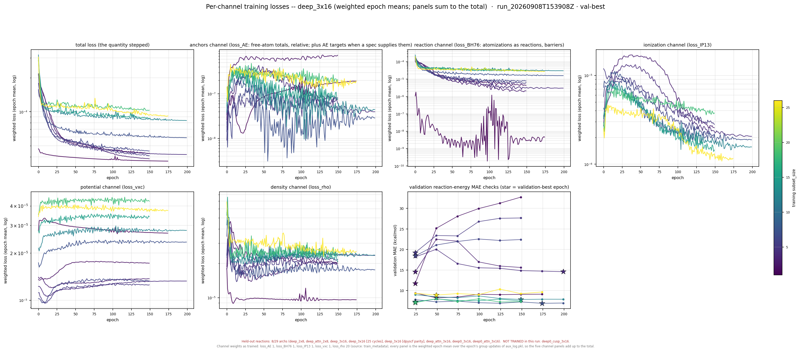

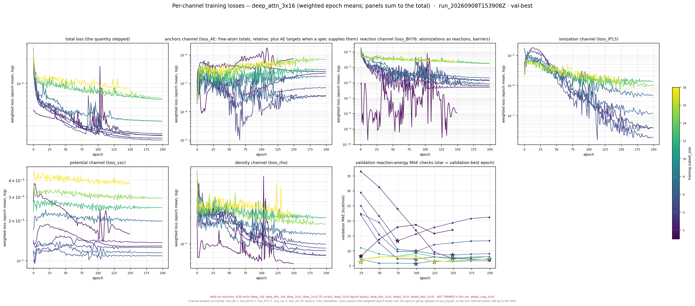

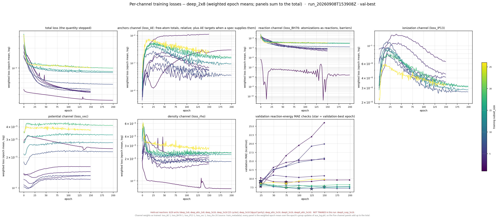

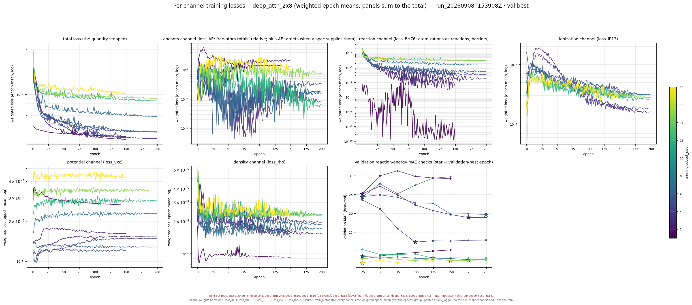

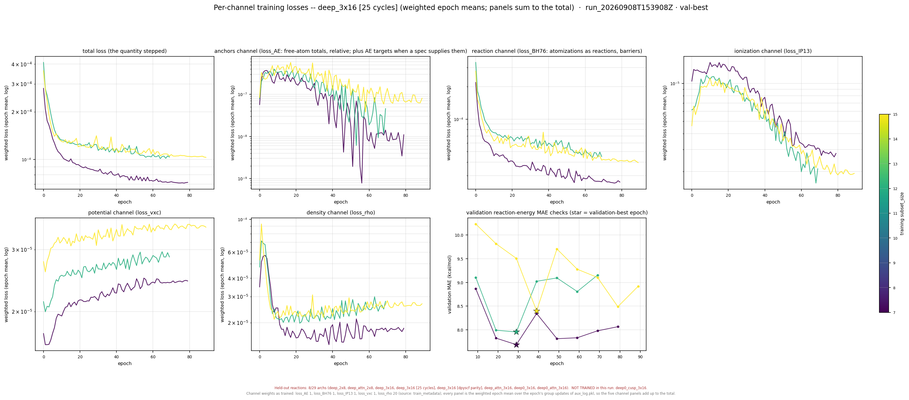

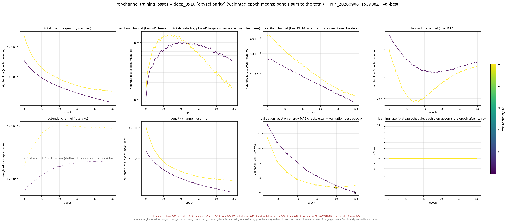

### 4.4 Trained enhancement factors

**Fig. 4.3** The trained networks against PBE, one figure per architecture, four panels, one
curve per subset size at the validation-best checkpoint. Top left: $F_x(s)$ at $n = 1$ and
zero extra descriptors, PBE dashed. Top right: $F_x^{\rm NN} - F_x^{\rm PBE}$ on the same
slice. Bottom left: $F_c(s; r_s = 2)$ at $\zeta = 0$, PBE dashed. Bottom right: the
correlation difference. The pre-trained curves of Fig. 3.3 are the starting point of every
curve here, and the footer gives the largest $|\Delta F_x|$ over the slice.

Exchange, all six architectures and both arms (the numbers from `trained_fx_fc_curves.csv`):
every trained network lowers $F_x$ below PBE between $s \approx 0.3$ and 1.0 to 1.7 (by 0.002
to 0.06 at the dip, $s = 0.55$ to 1.33) and raises it above PBE beyond, with the largest
$|\Delta F_x|$ over the slice at $s = 1.9$ to 3.4 in every cell but deep_attn_3x16 at seven
molecules, whose largest deviation is its dip (0.04 at $s = 1.1$): deep_3x16 0.09 to 0.18 (the
two-to-six-molecule cells 0.14 to 0.18, the rest 0.09 to 0.11), deep_attn_3x16 0.04 to 0.13,
deep0_3x16 0.05 to 0.14, deep0_attn_3x16 0.08 to 0.19, deep_2x8 0.06 to 0.08 (the smallest
corrections of the campaign, at $s = 2.2$ to 3.0), deep_attn_2x8 0.07 to 0.19 (at $s = 1.9$
to 2.4, the largest at two molecules), the 25-cycle arm 0.11 to 0.13 and the parity arm 0.11
and 0.13 (against 0.09 to 0.11 for the size group's deep_3x16 at the same subsets). At $s =
6$ the difference has decayed to $-0.05$ to $+0.06$ over the 3x16 cells (below PBE in the two
attention cells at two molecules, within $+0.02$ of it in deep_attn_3x16 from seven molecules
upward, $+0.02$ to $+0.06$ in the other 3x16 cells) and to $+0.02$ to $+0.04$ in deep_2x8,
while deep_attn_2x8 ends within $\pm 0.035$ of PBE there. The shape is the same at every
subset size; the one-molecule cell moves least. Correlation at $r_s = 2$: PBE's $F_c$ falls
from 1 at $s = 0$ to 0.02 at $s = 3$; up to $s = 2$ the trained $F_c$ runs from 0.10 (the
parity cells, which stay at PBE) to 1.29 (deep_3x16 at four molecules) across the cells, and
beyond that the cells separate. deep_3x16: the one-molecule cell returns to PBE
(a difference of 0.2 at $s = 1$ and 0 beyond 3), the four-molecule cell and the cells at
seven and twelve molecules rise to 1.1 to 1.3 at $s = 6$, the two-, three-, five- and
six-molecule cells decay to 0.14 to 0.22 and the cells at fifteen to twenty-six to 0.4 to 0.6.
deep0_3x16: the one-molecule cell as for deep_3x16, the four-molecule cell 1.5 at $s = 6$, the
fifteen-molecule cell flat at 0.8 from $s = 2$, the seven-, twelve- and twenty-six-molecule
cells 1.0 to 1.2, the others 0.1 to 0.25. deep_attn_3x16: the one-molecule cell returns to
PBE, every other cell rises above 1 from $s = 2$ to 3 onward, to 1.2 (three molecules), 1.4
(two and four), 1.7 (seven), 1.9 (five, six, twelve and fifteen) and back to 0.8 at
eighteen, at $s = 6$. deep0_attn_3x16: the one-molecule cell returns to PBE, the others end
between 0.4 (twelve) and 1.8 (five) at $s = 6$. The 2x8 pair: deep_2x8's one-molecule cell
returns to PBE, its two-to-six-molecule cells decay to 0.20 to 0.41 at $s = 6$ and its cells
from seven upward rise to 1.02 to 1.27, the mirror image of deep_3x16's small-subset rise;
deep_attn_2x8 ends at 0.05 to 0.08 (two and five molecules), 0.33 (eighteen) and 0.73 to 1.02
(the rest). The arms: the 25-cycle cells end at 0.17, 0.43 and 0.65 (seven, twelve, fifteen)
against 1.08, 1.16 and 0.39 for the size group's cells of the same subsets, and the parity
cells keep $F_c$ within 0.07 of PBE at $r_s = 2$ over the whole slice (the largest difference
0.067 at $s = 1.0$; 0.075 at $r_s = 5$), the one trained correlation factor of the campaign
that stays at its parent.
The correlation difference therefore reaches 0.2 to 1.9 at large $s$ depending on the cell.
The corrections are therefore not small perturbations of PBE: the density-gradient
dependence of both channels is reshaped in the region $s > 1.5$, which is populated by the
valence tails and the bonding regions of molecules, and what Sec. 5 measures is how that
reshaping transfers.

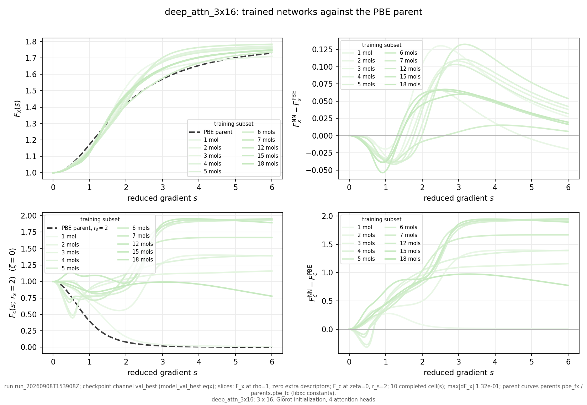

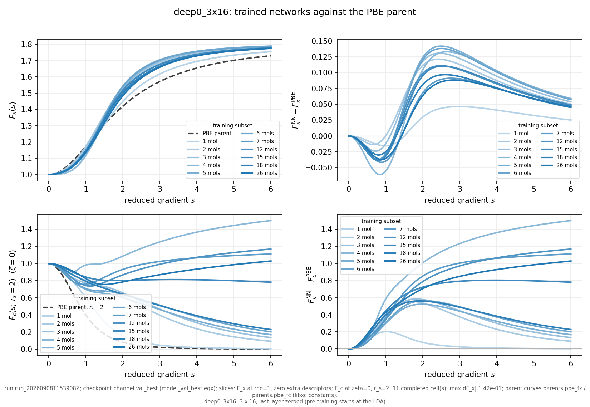

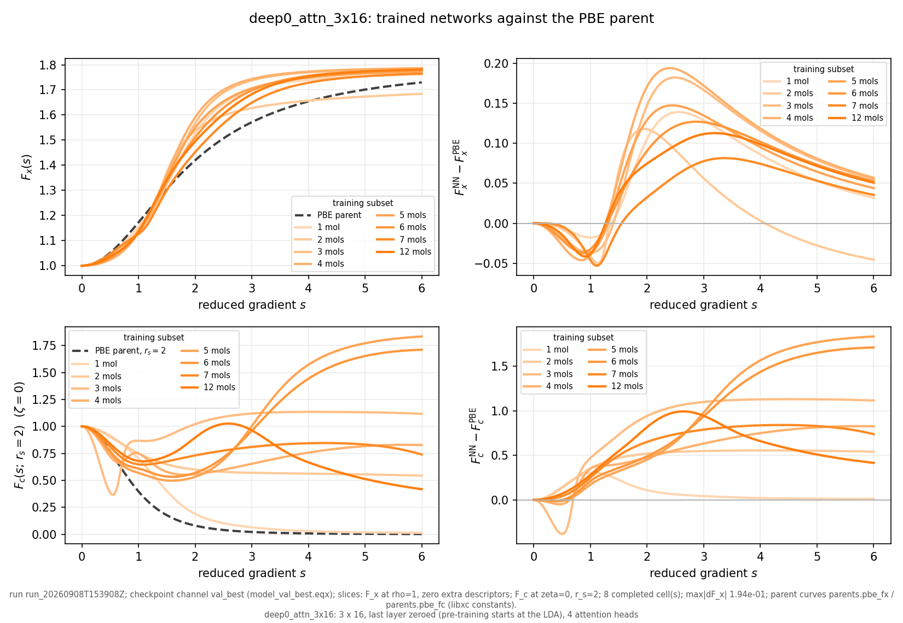

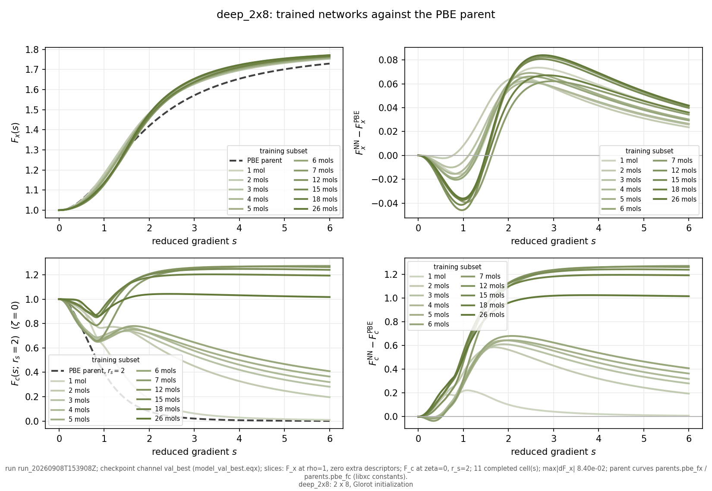

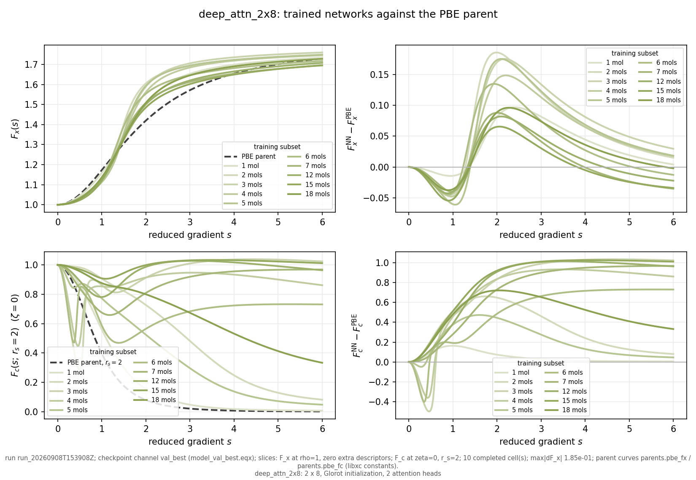

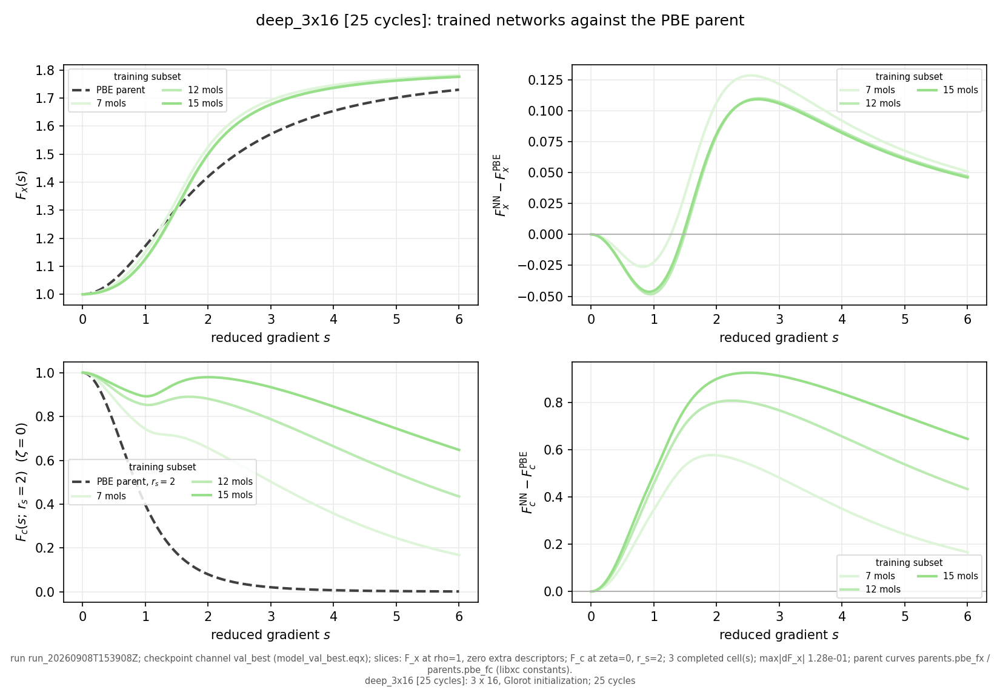

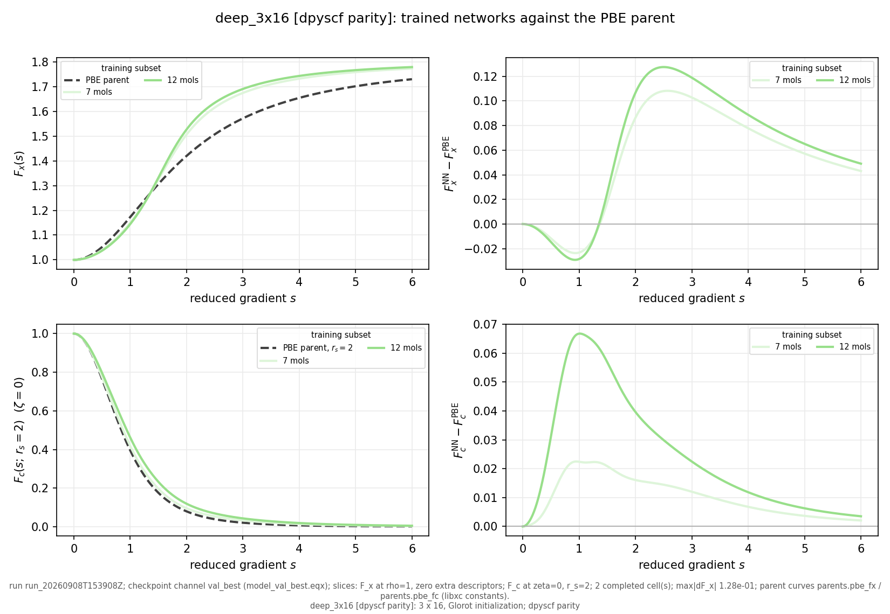

### 4.5 In-sample fit

The grid-RMSE density fit (Fig. 4.4 of the full report) is not repeated here; the per-cell ratios are in its table there.

**Fig. 4.5** In-sample energy and density in DFS units, the 3x3 layout of Fig. 5.5 on the
training set: rows WTMAD-2 / $\varepsilon_n$ / $\mathcal{ED}$, columns BH76 / W4-11 /
combined, each cell against PBE on its own training reactions and molecules. The energy leg is
the training reactions themselves (the W4-11 atomizations as molecule-to-atoms reactions and
the BH76 barriers of `train_metadata.json`), each formed from the final checkpoint's
self-consistent species energies in `eval/per_molecule.json` against its reference; PBE on the
same reactions from the same file's PBE energies. The dashed line is PBE on the union of the
run's training reactions (18.6 kcal/mol for the BH76 barriers, 3.83 for the W4-11
atomizations, 5.67 combined, the same union for every run since the runs train the same subsets); the capped spans and the verdict triangles use each
cell's own reactions. A cell whose subset has no reaction of a column (the one-molecule cell
in the BH76 column; the three-molecule cell, whose subset is H2O, Li+ and a barrier, in the
W4-11 column) has no bar there.

Panel A (BH76 energy): deep_3x16's barrier residual grows with the subset from 2.7 kcal/mol at
two molecules to 9.5 at twenty-six, against 18.6 for PBE on the union; deep_attn_3x16 0.8 to
7.6, deep0_3x16 1.8 to 9.8, deep0_attn_3x16 1.4 to 6.3, deep_2x8 3.5 to 9.2, deep_attn_2x8 1.0
to 8.8; the 25-cycle arm 6.7 to 8.3 beside the size group's 7.0 to 8.1 at the same subsets,
and the parity arm 17.3 and 14.7 (its reaction term trained at weight 0.01). Panel B (W4-11):
deep_3x16 0.02 (one molecule, H2O fitted to 0.02 kcal/mol) to 1.6, deep_attn_3x16 0.05 to 1.1,
deep0_3x16 0.00 to 1.3, deep0_attn_3x16 0.05 to 0.9, deep_2x8 0.05 to 2.5, deep_attn_2x8 0.01
to 1.4, the arms 0.7 to 1.5, against PBE's 3.83. Panel C: the two-subset combination, 0.00 to
5.4 against 5.67 on the union of the training reactions of every cell, the parity arm (4.5
and 5.4) the closest to PBE. Panels D to F (density): the trained molecules' $\varepsilon_n$ is
0.0073 (one molecule) to 0.0135 (two) for deep_3x16, 0.0049 to 0.0078 for deep_attn_3x16,
0.0072 to 0.0139 for deep0_3x16, 0.0051 to 0.0120 for deep0_attn_3x16, 0.0067 to 0.0145 for
deep_2x8, 0.0068 to 0.0115 for deep_attn_2x8, 0.0102 to 0.0108 for the 25-cycle arm and
0.0078 and 0.0083 for the parity arm, against PBE's 0.0089 on the union of the trained
molecules; the deep_3x16 cells at two to eighteen molecules sit above PBE on this
per-electron L1 while their grid RMSE (Fig. 4.4 of the full report) sits below it: the two
norms rank the small-subset fits differently. Panels G to I: every one of the 66 cells'
$\mathcal{ED}$ is below PBE's on its own slice (0.00 to 7.5 against 0.79 to 13.3), the energy
leg deciding the combination at every subset.

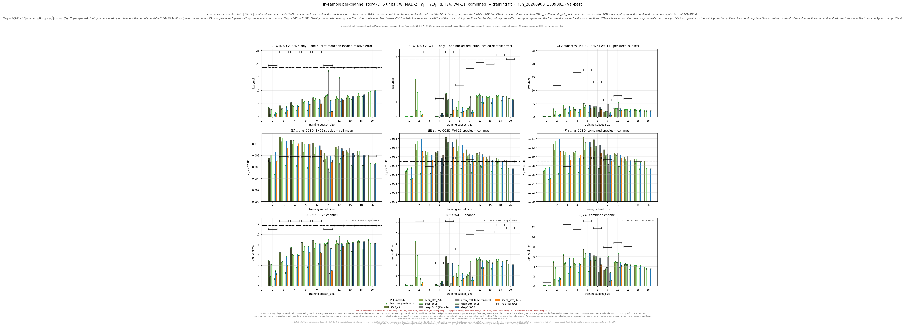

### 4.6 Results per cell

**In-sample per cell in DFS units** (`insample_by_pool_3x3_eps.csv` of the family `_val_best`
set, identical in the final-step set; combined leg; E = 2-subset WTMAD-2 over the cell's own
training reactions, kcal/mol; eps over its training molecules; ED under gamma = 1084.87
kcal/mol; the PBE columns are the union of the run's training reactions / molecules for E and
eps and the cell's own slice for ED; n = training reactions and trained species with a density).

<!-- table:insample_combined -->
| Architecture | Subset | n rxn | n species | E NN | E PBE (pool) | eps NN | eps PBE (pool) | ED NN | ED PBE (cell) | dED | beats |
|---|---|---|---|---|---|---|---|---|---|---|---|
| deep_2x8 | 1 | 1 | 1 | 0.05 | 5.67 | 0.00670 | 0.00888 | 0.11 | 0.79 | **-0.68** | yes |
| deep_2x8 | 2 | 2 | 3 | 3.00 | 5.67 | 0.01278 | 0.00888 | 4.93 | 11.27 | **-6.35** | yes |
| deep_2x8 | 3 | 2 | 3 | 4.32 | 5.67 | 0.01126 | 0.00888 | 6.39 | 12.57 | **-6.18** | yes |
| deep_2x8 | 4 | 3 | 4 | 3.65 | 5.67 | 0.01107 | 0.00888 | 5.60 | 11.58 | **-5.98** | yes |
| deep_2x8 | 5 | 3 | 4 | 4.92 | 5.67 | 0.01447 | 0.00888 | 7.50 | 13.25 | **-5.76** | yes |
| deep_2x8 | 6 | 4 | 5 | 3.93 | 5.67 | 0.01381 | 0.00888 | 6.22 | 11.78 | **-5.56** | yes |
| deep_2x8 | 7 | 5 | 6 | 1.84 | 5.67 | 0.01157 | 0.00888 | 3.22 | 7.89 | **-4.68** | yes |
| deep_2x8 | 12 | 10 | 11 | 2.98 | 5.67 | 0.01075 | 0.00888 | 4.75 | 8.86 | **-4.11** | yes |
| deep_2x8 | 15 | 13 | 14 | 2.70 | 5.67 | 0.00986 | 0.00888 | 4.31 | 8.08 | **-3.77** | yes |
| deep_2x8 | 18 | 16 | 16 | 2.63 | 5.67 | 0.00956 | 0.00888 | 4.19 | 8.01 | **-3.82** | yes |
| deep_2x8 | 26 | 24 | 22 | 2.33 | 5.67 | 0.00909 | 0.00888 | 3.77 | 7.14 | **-3.37** | yes |
| deep_attn_2x8 | 1 | 1 | 1 | 0.01 | 5.67 | 0.00683 | 0.00888 | 0.02 | 0.79 | **-0.77** | yes |
| deep_attn_2x8 | 2 | 2 | 3 | 0.72 | 5.67 | 0.01144 | 0.00888 | 1.37 | 11.27 | **-9.91** | yes |
| deep_attn_2x8 | 3 | 2 | 3 | 2.86 | 5.67 | 0.01041 | 0.00888 | 4.56 | 12.57 | **-8.01** | yes |
| deep_attn_2x8 | 4 | 3 | 4 | 2.87 | 5.67 | 0.01086 | 0.00888 | 4.62 | 11.58 | **-6.96** | yes |
| deep_attn_2x8 | 5 | 3 | 4 | 3.59 | 5.67 | 0.01150 | 0.00888 | 5.58 | 13.25 | **-7.68** | yes |
| deep_attn_2x8 | 6 | 4 | 5 | 3.25 | 5.67 | 0.01122 | 0.00888 | 5.13 | 11.78 | **-6.65** | yes |
| deep_attn_2x8 | 7 | 5 | 6 | 2.02 | 5.67 | 0.01023 | 0.00888 | 3.41 | 7.89 | **-4.48** | yes |
| deep_attn_2x8 | 12 | 10 | 11 | 3.23 | 5.67 | 0.01061 | 0.00888 | 5.05 | 8.86 | **-3.81** | yes |
| deep_attn_2x8 | 15 | 13 | 14 | 2.89 | 5.67 | 0.00946 | 0.00888 | 4.51 | 8.08 | **-3.56** | yes |
| deep_attn_2x8 | 18 | 16 | 16 | 2.74 | 5.67 | 0.00855 | 0.00888 | 4.23 | 8.01 | **-3.78** | yes |
| deep_3x16 | 1 | 1 | 1 | 0.02 | 5.67 | 0.00728 | 0.00888 | 0.05 | 0.79 | **-0.74** | yes |
| deep_3x16 | 2 | 2 | 3 | 2.14 | 5.67 | 0.01353 | 0.00888 | 3.73 | 11.27 | **-7.55** | yes |
| deep_3x16 | 3 | 2 | 3 | 2.96 | 5.67 | 0.01106 | 0.00888 | 4.75 | 12.57 | **-7.82** | yes |
| deep_3x16 | 4 | 3 | 4 | 2.63 | 5.67 | 0.01118 | 0.00888 | 4.33 | 11.58 | **-7.25** | yes |
| deep_3x16 | 5 | 3 | 4 | 4.31 | 5.67 | 0.01315 | 0.00888 | 6.63 | 13.25 | **-6.63** | yes |
| deep_3x16 | 6 | 4 | 5 | 3.92 | 5.67 | 0.01234 | 0.00888 | 6.06 | 11.78 | **-5.72** | yes |
| deep_3x16 | 7 | 5 | 6 | 2.04 | 5.67 | 0.01042 | 0.00888 | 3.46 | 7.89 | **-4.44** | yes |
| deep_3x16 | 12 | 10 | 11 | 3.11 | 5.67 | 0.01026 | 0.00888 | 4.86 | 8.86 | **-4.00** | yes |
| deep_3x16 | 15 | 13 | 14 | 2.78 | 5.67 | 0.00900 | 0.00888 | 4.32 | 8.08 | **-3.76** | yes |
| deep_3x16 | 18 | 16 | 16 | 2.60 | 5.67 | 0.00944 | 0.00888 | 4.14 | 8.01 | **-3.86** | yes |
| deep_3x16 | 26 | 24 | 22 | 2.23 | 5.67 | 0.00731 | 0.00888 | 3.49 | 7.14 | **-3.66** | yes |
| deep_3x16 [25 cycles] | 7 | 5 | 6 | 2.18 | 5.67 | 0.01070 | 0.00888 | 3.67 | 7.89 | **-4.22** | yes |
| deep_3x16 [25 cycles] | 12 | 10 | 11 | 3.06 | 5.67 | 0.01081 | 0.00888 | 4.86 | 8.86 | **-4.00** | yes |
| deep_3x16 [25 cycles] | 15 | 13 | 14 | 2.68 | 5.67 | 0.01016 | 0.00888 | 4.31 | 8.08 | **-3.77** | yes |
| deep_3x16 [dpyscf parity] | 7 | 5 | 6 | 4.52 | 5.67 | 0.00829 | 0.00888 | 6.01 | 7.89 | **-1.88** | yes |
| deep_3x16 [dpyscf parity] | 12 | 10 | 11 | 5.42 | 5.67 | 0.00780 | 0.00888 | 6.61 | 8.86 | **-2.25** | yes |
| deep_attn_3x16 | 1 | 1 | 1 | 0.05 | 5.67 | 0.00494 | 0.00888 | 0.09 | 0.79 | **-0.70** | yes |
| deep_attn_3x16 | 2 | 2 | 3 | 0.59 | 5.67 | 0.00617 | 0.00888 | 1.08 | 11.27 | **-10.20** | yes |
| deep_attn_3x16 | 3 | 2 | 3 | 1.57 | 5.67 | 0.00626 | 0.00888 | 2.55 | 12.57 | **-10.02** | yes |
| deep_attn_3x16 | 4 | 3 | 4 | 1.68 | 5.67 | 0.00648 | 0.00888 | 2.71 | 11.58 | **-8.87** | yes |
| deep_attn_3x16 | 5 | 3 | 4 | 1.77 | 5.67 | 0.00732 | 0.00888 | 2.89 | 13.25 | **-10.36** | yes |
| deep_attn_3x16 | 6 | 4 | 5 | 1.72 | 5.67 | 0.00724 | 0.00888 | 2.83 | 11.78 | **-8.96** | yes |
| deep_attn_3x16 | 7 | 5 | 6 | 0.53 | 5.67 | 0.00640 | 0.00888 | 0.98 | 7.89 | **-6.92** | yes |
| deep_attn_3x16 | 12 | 10 | 11 | 2.45 | 5.67 | 0.00784 | 0.00888 | 3.80 | 8.86 | **-5.05** | yes |
| deep_attn_3x16 | 15 | 13 | 14 | 2.20 | 5.67 | 0.00667 | 0.00888 | 3.37 | 8.08 | **-4.70** | yes |
| deep_attn_3x16 | 18 | 16 | 16 | 2.29 | 5.67 | 0.00722 | 0.00888 | 3.54 | 8.01 | **-4.47** | yes |
| deep0_3x16 | 1 | 1 | 1 | 0.00 | 5.67 | 0.00753 | 0.00888 | 0.00 | 0.79 | **-0.79** | yes |
| deep0_3x16 | 2 | 2 | 3 | 0.91 | 5.67 | 0.01392 | 0.00888 | 1.72 | 11.27 | **-9.56** | yes |
| deep0_3x16 | 3 | 2 | 3 | 3.81 | 5.67 | 0.01046 | 0.00888 | 5.71 | 12.57 | **-6.86** | yes |
| deep0_3x16 | 4 | 3 | 4 | 2.92 | 5.67 | 0.00969 | 0.00888 | 4.57 | 11.58 | **-7.01** | yes |
| deep0_3x16 | 5 | 3 | 4 | 4.36 | 5.67 | 0.01327 | 0.00888 | 6.69 | 13.25 | **-6.56** | yes |
| deep0_3x16 | 6 | 4 | 5 | 3.61 | 5.67 | 0.01257 | 0.00888 | 5.71 | 11.78 | **-6.08** | yes |
| deep0_3x16 | 7 | 5 | 6 | 1.58 | 5.67 | 0.01038 | 0.00888 | 2.77 | 7.89 | **-5.12** | yes |
| deep0_3x16 | 12 | 10 | 11 | 3.00 | 5.67 | 0.01037 | 0.00888 | 4.74 | 8.86 | **-4.12** | yes |
| deep0_3x16 | 15 | 13 | 14 | 2.72 | 5.67 | 0.00913 | 0.00888 | 4.27 | 8.08 | **-3.80** | yes |
| deep0_3x16 | 18 | 16 | 16 | 2.66 | 5.67 | 0.00873 | 0.00888 | 4.16 | 8.01 | **-3.85** | yes |
| deep0_3x16 | 26 | 24 | 22 | 2.22 | 5.67 | 0.00721 | 0.00888 | 3.46 | 7.14 | **-3.68** | yes |
| deep0_attn_3x16 | 1 | 1 | 1 | 0.05 | 5.67 | 0.00508 | 0.00888 | 0.09 | 0.79 | **-0.70** | yes |
| deep0_attn_3x16 | 2 | 2 | 3 | 0.77 | 5.67 | 0.01118 | 0.00888 | 1.45 | 11.27 | **-9.83** | yes |
| deep0_attn_3x16 | 3 | 2 | 3 | 2.42 | 5.67 | 0.00926 | 0.00888 | 3.91 | 12.57 | **-8.66** | yes |
| deep0_attn_3x16 | 4 | 3 | 4 | 2.68 | 5.67 | 0.01033 | 0.00888 | 4.32 | 11.58 | **-7.26** | yes |
| deep0_attn_3x16 | 5 | 3 | 4 | 3.23 | 5.67 | 0.01205 | 0.00888 | 5.18 | 13.25 | **-8.07** | yes |
| deep0_attn_3x16 | 6 | 4 | 5 | 2.61 | 5.67 | 0.01084 | 0.00888 | 4.27 | 11.78 | **-7.52** | yes |
| deep0_attn_3x16 | 7 | 5 | 6 | 0.60 | 5.67 | 0.00898 | 0.00888 | 1.14 | 7.89 | **-6.76** | yes |
| deep0_attn_3x16 | 12 | 10 | 11 | 2.55 | 5.67 | 0.00975 | 0.00888 | 4.10 | 8.86 | **-4.75** | yes |
<!-- /table:insample_combined -->

## 5. Optimization, hold-out

Sources: `xcquinox/pipeline/evaluation.py` (the density metrics), `docs/notes/HOLDOUT_SET.md`
(the set), `tools/analysis/make_ablation_arch_figure.py` (the reductions, WTMAD-2 and ED),
per cell `eval_holdout_val_best/per_reaction.json` and `per_molecule.json`, and the CSVs written
beside the figures.

### 5.1 The held-out set and the comparators

The held-out pool is the union of the GMTKN55 BH76 barrier heights and the W4-11 atomization
energies. Its test slice, after the removal of the 35-reaction validation slice (which selects
the validation-best checkpoint and never enters a reported number), of each cell's verbatim
training reactions, carries 61 BH76 rows (three listed twice by name, four more as permuted-name
twins; the energy legs average one term per barrier identity, 54) and 120 W4-11 reactions (the
`n rxn` column of the tables below counts name-deduplicated rows, 58 BH76 at one point), and the density comparison runs over 189 molecular
species with CCSD reference densities at the same basis and grid (atoms excluded). PBE is
evaluated on exactly the same slice as each cell, so every comparison is like against like; the
pooled PBE values are 7.98 (BH76), 13.74 (W4-11) and 11.86 kcal/mol (combined) reaction-energy
MAE, and 8.92 kcal/mol 2-subset WTMAD-2. The functionals are evaluated with the same 3-cycle SCF
they were trained with (Sec. 4.2); the PBE density is the converged reference calculation's.

### 5.2 Metrics

**Energy.** Per-reaction absolute error $|E^{\rm NN}_{\rm rxn} - E^{\rm ref}_{\rm rxn}|$, reduced
either as the plain MAE over a pool or as the two-bucket WTMAD-2 of GMTKN55 (Goerigk et al.,
PCCP 19, 32184 (2017)),

$$
\mathrm{WTMAD\text{-}2} = \frac{56.84}{N}\sum_{i\in\{\rm BH76,\,W4\text{-}11\}} N_i\,\frac{\mathrm{MAD}_i}{\overline{|\Delta E_{\rm ref}|}_i},
$$

a labeled reweighting of the two present subsets, not the full-GMTKN55 quantity (the figures say
so). When one pool is reported alone the same expression collapses to $56.84\,
\mathrm{MAD}_i / \overline{|\Delta E_{\rm ref}|}_i$, the pool's mean absolute deviation
rescaled by its mean absolute reference energy: the BH76 column of the 3x3 figures is a scaled
relative error, which is why it reads three times the plain MAE (a mean barrier of about 19
kcal/mol) while the W4-11 column reads a fifth of it (a mean atomization energy of about 350
kcal/mol). **Density.** Per species, the grid-weighted RMSE $\sqrt{\sum_g w_g (n_g -
n_g^{\rm ref})^2 / \sum_g w_g}$ (the self-calibrated figures) and the DFS Eq. 20 per-electron
error

$$
\varepsilon_n = \frac{1}{N_e}\int |n - n^{\rm ref}|\, d^3r, \qquad N_e = \int n^{\rm ref}\, d^3r
$$

(the DFS-units figures), each reduced to a cell mean over species with case twins collapsed.
**Combined.** The DFS Eq. 21 harmonic combination

$$
\mathcal{ED} = \frac{2}{1/E + 1/(\gamma D)},
$$

with $E$ the WTMAD-2 energy leg and $D$ the density leg. In DFS units $\gamma = 1084.87$
kcal/mol, the Letter's published slope, is dimensionally valid on $\varepsilon_n$ and is used as
is; in the RMSE units the figures self-calibrate $\gamma = E_{\rm PBE}/D_{\rm PBE}$ from the
pooled PBE anchors, so that $\mathcal{ED}_{\rm PBE} = E_{\rm PBE}$ by construction and the NN
against PBE ranking is independent of the density scale. A cell "beats PBE" when its
$\mathcal{ED}$ is below the PBE $\mathcal{ED}$ of the same slice. The harmonic mean is
dominated by its smaller leg: with $\gamma \varepsilon_n$ between 9.6 and 13.6 kcal/mol for
every functional here and $E$ between 5.9 and 16.2 kcal/mol, a change of 1 kcal/mol in $E$
moves $\mathcal{ED}$ by 0.4 to 0.9 kcal/mol (the derivative $2 (\gamma D)^2 / (E + \gamma
D)^2$ over the 64 cells' own legs), while the observed spread of the density leg (0.0088 to
0.0125 per electron, 9.6 to 13.6 kcal/mol after $\gamma$) moves it by at most 2.7 kcal/mol,
at the largest energy leg, and by 1.3 at $E = 8$.

### 5.3 Held-out energy

The energy figures of the full report (Figs. 5.1 to 5.3) are not repeated here; their readings are in Sec. 5.8.

### 5.4 Held-out density

The grid-RMSE density figures of the full report (Fig. 5.4 of the full report) are not repeated here; their readings are in Sec. 5.8.

### 5.5 The per-pool 3x3 in DFS units

**Fig. 5.5** The held-out result in the Letter's units, nine panels: the rows are the energy
leg (WTMAD-2), the density leg ($\varepsilon_n$, Eq. 20) and the combination ($\mathcal{ED}$
under the one shared $\gamma = 1084.87$ kcal/mol); the columns are the BH76 barriers, the W4-11
atomizations and both pooled. In every panel the abscissa is the subset size, the bars are the
architectures (the greens deep_2x8, deep_attn_2x8, deep_3x16 and deep_attn_3x16, the greys the
two arms, the blue deep0_3x16, the orange deep0_attn_3x16, in the display order), the
dashed line is PBE on the pooled slice and the black cap over each subset size is PBE on that
cell's own slice; a triangle on a bar marks a cell below its cap. The first figure of each
pair is the full set, the second the tail-excluded one. The panel values are in the four
tables of Sec. 5.7.

Row 1 (energy). Panel A, BH76: PBE's scaled relative error is 22.1 kcal/mol; deep_3x16 reads 21.3
at one molecule, 23.6 to 36.6 at two to six (the peak at five), 16.3 at seven, 16.7 to 20.0
from twelve to twenty-six; deep_attn_3x16 22.8 at one, then 20.6, 15.3, 14.6, 13.3, 14.0 and 15.5.
Panel B, W4-11: PBE 2.54; deep_3x16 1.41 at one, 2.95 to 3.54 at two to six, 1.70 to 2.01 from
seven; deep_attn_3x16 1.17, 1.80, 3.46, 2.06, 2.63, 2.38, 1.31. Panel C, the two-subset WTMAD-2 of
Fig. 5.1 of the full report.

Row 2 (density). PBE's $\varepsilon_n$ is 0.00928 (BH76 species), 0.00891 (W4-11) and 0.00923
(combined) per electron. Panel D: deep_3x16 0.0093 at one, 0.0119 to 0.0136 at two to six, 0.0102
to 0.0111 from seven; deep_attn_3x16 0.0093, 0.0081, 0.0107, 0.0099, 0.0083, 0.0087, 0.0087, so
the attention twin is below PBE at two, five, six and seven. Panel E: every deep_3x16 cell is
above PBE (0.0093 to 0.0109), and so is every deep_attn_3x16 cell, at one and five molecules by
less than 0.4 percent (0.00894 and 0.00892 against 0.00891). Panel F, the combination of both.

Row 3 (the combination). Panel G, BH76: PBE 13.8; deep_3x16 13.7 at one, 16.7 to 19.7 at two to
six, 13.6 to 14.7 from seven; deep_attn_3x16 14.0 at one and 10.8 to 13.2 from two to seven. Panel
H, W4-11: PBE 4.02; deep_3x16 2.48 at one, 4.65 to 5.45 at two to six, 2.93 to 3.36 from seven;
deep_attn_3x16 2.09, 3.10, 5.14, 3.48, 4.13, 3.92, 2.33. Panel I, combined, the verdict column of
the tables.

deep0_3x16, the same panels: BH76 energy 21.5, 22.0, 17.5, 17.8, 26.6, 25.9, 14.6, 17.5,
17.6, 16.8, 21.1 at one to twenty-six; W4-11 energy 1.68, 3.05, 3.54, 3.50, 2.97, 3.12, 1.67,
2.10, 1.99, 1.88, 1.87; combined $\varepsilon_n$ 0.0096 to 0.0116, above PBE in every cell;
combined $\mathcal{ED}$ 9.32, 10.54, 9.44, 9.83, 11.16, 11.10, 7.77, 8.78, 8.63, 8.37, 9.38
against the cell caps 9.46, 9.44, 9.32, 9.34, 9.32, 9.34, 9.49, 9.56, 9.60, 9.62, 9.80. The
deep_attn_3x16 cells at twelve, fifteen and eighteen molecules: BH76 energy 16.45, 16.56 and
17.24, W4-11 1.87, 1.56 and 1.50, combined $\varepsilon_n$ 0.0102, 0.0096 and 0.0099,
combined $\mathcal{ED}$ 8.27, 7.97 and 8.27 against 9.56, 9.60 and 9.62. deep0_attn_3x16 over
its eight cells: BH76 energy 22.38, 33.73, 23.92, 21.92, 16.56, 15.62, 15.91 and 18.34, W4-11
1.15, 4.10, 2.80, 2.72, 3.61, 2.80, 1.33 and 2.04, combined $\varepsilon_n$ 0.0091 to 0.0118
(above PBE in every cell but the first), combined $\mathcal{ED}$ 8.89, 13.14, 10.91, 10.28,
9.49, 8.68, 8.12 and 9.09 against 9.46, 9.44, 9.32, 9.34, 9.32, 9.34, 9.49 and 9.56.

The 2x8 pair. deep_2x8: BH76 energy 21.68, 16.51, 20.02, 21.72, 22.15, 22.66, 15.19, 17.43,
16.82, 16.17 and 17.88 at one to twenty-six; W4-11 1.59, 1.97, 2.28, 2.45, 2.25, 2.35, 1.82,
2.02, 1.95, 2.07 and 2.24, below PBE's 2.54 at every size; combined $\varepsilon_n$
0.0095 at one, 0.0112 to 0.0115 at two to six and 0.0102 to 0.0108 from seven; combined
$\mathcal{ED}$ 9.13, 8.58, 9.69, 10.20, 10.09, 10.29, 8.08, 8.78, 8.53, 8.51 and 9.03 against
the caps above, below PBE at one, two and from seven on. deep_attn_2x8: BH76 energy 21.52,
40.33, 37.72, 28.82, 35.08, 21.57, 18.97, 19.18 and 18.70 at one to fifteen; W4-11 1.38, 4.73,
3.46, 2.58, 4.15, 4.84, 1.40, 1.97 and 1.79; combined $\varepsilon_n$ 0.0091 at one, 0.0101 to
0.0125 elsewhere; combined $\mathcal{ED}$ 8.82, 14.39, 13.97, 11.70, 12.66, 10.58, 8.65, 9.17
and 8.84, below PBE at one, seven, twelve and fifteen. The two arms at seven and twelve: BH76
energy 17.15 and 18.05 (25 cycles), 19.50 and 19.53 (dpyscf parity); W4-11 1.97 and 1.92,
1.62 and 1.67; combined $\varepsilon_n$ 0.0097 and 0.0098 (25 cycles), 0.0090 and 0.0089
(dpyscf parity, the two cells of the campaign below PBE's 0.0092 on the full slice at seven
or more molecules); combined $\mathcal{ED}$ 8.36 and 8.57, 8.46 and 8.44, against 9.49 and
9.56, every one below PBE.

### 5.7 Results per cell

The two tables below (the per-leg tables are in the full report) are read from `holdout_by_pool_3x3_eps.csv` of the family `_val_best`
set (the tail-excluded one from the `_excl_tail` sibling): E is the WTMAD-2 of the leg in
kcal/mol (the one-pool legs collapse to the scaled relative error of Sec. 5.2), eps the
per-electron density error of the leg's species, ED the combination under $\gamma = 1084.87$
kcal/mol; the E PBE and eps PBE columns are the leg's pooled PBE values (the same in every
row), ED PBE (cell) is PBE's ED on the cell's own slice, and "beats" whether the network's ED
is below it. n rxn and n species are the reactions and species of the cell's slice. Every table
carries the 64 evaluated cells in the display order of the architectures (a tagged
architecture after its untagged one) and then the subset size; the run of a cell is that of
its architecture in the scope table (the report's tables of Sec. 4.6
carry it as a column). The pooled PBE columns of the tail-excluded table are its own file's,
computed without the excluded species (eps PBE 0.00909 against 0.00923).

**Combined leg** (both pools).

<!-- table:holdout_combined -->
| Architecture | Subset | n rxn | n species | E NN | E PBE (pool) | eps NN | eps PBE (pool) | ED NN | ED PBE (cell) | dED | beats |
|---|---|---|---|---|---|---|---|---|---|---|---|
| deep_2x8 | 1 | 177 | 188 | 8.18 | 8.92 | 0.00952 | 0.00923 | 9.13 | 9.46 | **-0.33** | yes |
| deep_2x8 | 2 | 177 | 186 | 6.65 | 8.92 | 0.01116 | 0.00923 | 8.58 | 9.44 | **-0.85** | yes |
| deep_2x8 | 3 | 176 | 184 | 7.92 | 8.92 | 0.01148 | 0.00923 | 9.69 | 9.32 | +0.37 | no |
| deep_2x8 | 4 | 175 | 183 | 8.62 | 8.92 | 0.01152 | 0.00923 | 10.20 | 9.34 | +0.86 | no |
| deep_2x8 | 5 | 176 | 184 | 8.58 | 8.92 | 0.01128 | 0.00923 | 10.09 | 9.32 | +0.77 | no |
| deep_2x8 | 6 | 175 | 183 | 8.85 | 8.92 | 0.01134 | 0.00923 | 10.29 | 9.34 | +0.95 | no |
| deep_2x8 | 7 | 175 | 181 | 6.18 | 8.92 | 0.01076 | 0.00923 | 8.08 | 9.49 | **-1.41** | yes |
| deep_2x8 | 12 | 169 | 175 | 7.03 | 8.92 | 0.01076 | 0.00923 | 8.78 | 9.56 | **-0.78** | yes |
| deep_2x8 | 15 | 168 | 171 | 6.82 | 8.92 | 0.01050 | 0.00923 | 8.53 | 9.60 | **-1.07** | yes |
| deep_2x8 | 18 | 166 | 170 | 6.74 | 8.92 | 0.01064 | 0.00923 | 8.51 | 9.62 | **-1.11** | yes |
| deep_2x8 | 26 | 159 | 164 | 7.65 | 8.92 | 0.01015 | 0.00923 | 9.03 | 9.80 | **-0.77** | yes |
| deep_attn_2x8 | 1 | 177 | 188 | 7.98 | 8.92 | 0.00909 | 0.00923 | 8.82 | 9.46 | **-0.64** | yes |
| deep_attn_2x8 | 2 | 177 | 186 | 16.19 | 8.92 | 0.01193 | 0.00923 | 14.39 | 9.44 | +4.95 | no |
| deep_attn_2x8 | 3 | 176 | 184 | 14.36 | 8.92 | 0.01254 | 0.00923 | 13.97 | 9.32 | +4.65 | no |
| deep_attn_2x8 | 4 | 175 | 183 | 10.97 | 8.92 | 0.01156 | 0.00923 | 11.70 | 9.34 | +2.36 | no |
| deep_attn_2x8 | 5 | 176 | 184 | 13.99 | 8.92 | 0.01066 | 0.00923 | 12.66 | 9.32 | +3.34 | no |
| deep_attn_2x8 | 6 | 175 | 183 | 10.19 | 8.92 | 0.01014 | 0.00923 | 10.58 | 9.34 | +1.24 | no |
| deep_attn_2x8 | 7 | 175 | 181 | 7.12 | 8.92 | 0.01016 | 0.00923 | 8.65 | 9.49 | **-0.83** | yes |
| deep_attn_2x8 | 12 | 169 | 175 | 7.57 | 8.92 | 0.01073 | 0.00923 | 9.17 | 9.56 | **-0.39** | yes |
| deep_attn_2x8 | 15 | 168 | 171 | 7.32 | 8.92 | 0.01028 | 0.00923 | 8.84 | 9.60 | **-0.76** | yes |
| deep_3x16 | 1 | 177 | 188 | 7.92 | 8.92 | 0.00951 | 0.00923 | 8.96 | 9.46 | **-0.50** | yes |
| deep_3x16 | 2 | 177 | 186 | 9.61 | 8.92 | 0.01071 | 0.00923 | 10.52 | 9.44 | +1.08 | no |
| deep_3x16 | 3 | 176 | 184 | 10.67 | 8.92 | 0.01068 | 0.00923 | 11.11 | 9.32 | +1.79 | no |
| deep_3x16 | 4 | 175 | 183 | 11.06 | 8.92 | 0.01182 | 0.00923 | 11.88 | 9.34 | +2.53 | no |
| deep_3x16 | 5 | 176 | 184 | 13.97 | 8.92 | 0.01113 | 0.00923 | 12.96 | 9.32 | +3.64 | no |
| deep_3x16 | 6 | 175 | 183 | 13.51 | 8.92 | 0.01091 | 0.00923 | 12.62 | 9.34 | +3.28 | no |
| deep_3x16 | 7 | 175 | 181 | 6.44 | 8.92 | 0.01017 | 0.00923 | 8.13 | 9.49 | **-1.35** | yes |
| deep_3x16 | 12 | 169 | 175 | 7.41 | 8.92 | 0.01047 | 0.00923 | 8.97 | 9.56 | **-0.59** | yes |
| deep_3x16 | 15 | 168 | 171 | 6.89 | 8.92 | 0.01004 | 0.00923 | 8.44 | 9.60 | **-1.16** | yes |
| deep_3x16 | 18 | 166 | 170 | 6.74 | 8.92 | 0.00999 | 0.00923 | 8.31 | 9.62 | **-1.31** | yes |
| deep_3x16 | 26 | 159 | 164 | 8.23 | 8.92 | 0.00973 | 0.00923 | 9.25 | 9.80 | **-0.55** | yes |
| deep_3x16 [25 cycles] | 7 | 175 | 181 | 6.92 | 8.92 | 0.00972 | 0.00923 | 8.36 | 9.49 | **-1.13** | yes |
| deep_3x16 [25 cycles] | 12 | 169 | 175 | 7.17 | 8.92 | 0.00983 | 0.00923 | 8.57 | 9.56 | **-0.99** | yes |
| deep_3x16 [dpyscf parity] | 7 | 175 | 181 | 7.44 | 8.92 | 0.00903 | 0.00923 | 8.46 | 9.49 | **-1.03** | yes |
| deep_3x16 [dpyscf parity] | 12 | 169 | 175 | 7.48 | 8.92 | 0.00892 | 0.00923 | 8.44 | 9.56 | **-1.12** | yes |
| deep_attn_3x16 | 1 | 177 | 188 | 8.26 | 8.92 | 0.00925 | 0.00923 | 9.06 | 9.46 | **-0.40** | yes |
| deep_attn_3x16 | 2 | 177 | 186 | 7.87 | 8.92 | 0.00972 | 0.00923 | 9.01 | 9.44 | **-0.43** | yes |
| deep_attn_3x16 | 3 | 176 | 184 | 7.22 | 8.92 | 0.00981 | 0.00923 | 8.60 | 9.32 | **-0.72** | yes |
| deep_attn_3x16 | 4 | 175 | 183 | 6.09 | 8.92 | 0.01020 | 0.00923 | 7.85 | 9.34 | **-1.49** | yes |
| deep_attn_3x16 | 5 | 176 | 184 | 6.03 | 8.92 | 0.00883 | 0.00923 | 7.40 | 9.32 | **-1.92** | yes |
| deep_attn_3x16 | 6 | 175 | 183 | 6.09 | 8.92 | 0.00973 | 0.00923 | 7.73 | 9.34 | **-1.61** | yes |
| deep_attn_3x16 | 7 | 175 | 181 | 5.94 | 8.92 | 0.00963 | 0.00923 | 7.57 | 9.49 | **-1.91** | yes |
| deep_attn_3x16 | 12 | 169 | 175 | 6.61 | 8.92 | 0.01019 | 0.00923 | 8.27 | 9.56 | **-1.29** | yes |
| deep_attn_3x16 | 15 | 168 | 171 | 6.47 | 8.92 | 0.00956 | 0.00923 | 7.97 | 9.60 | **-1.63** | yes |
| deep_attn_3x16 | 18 | 166 | 170 | 6.72 | 8.92 | 0.00993 | 0.00923 | 8.27 | 9.62 | **-1.35** | yes |
| deep0_3x16 | 1 | 177 | 188 | 8.18 | 8.92 | 0.00997 | 0.00923 | 9.32 | 9.46 | **-0.14** | yes |
| deep0_3x16 | 2 | 177 | 186 | 9.16 | 8.92 | 0.01143 | 0.00923 | 10.54 | 9.44 | +1.10 | no |
| deep0_3x16 | 3 | 176 | 184 | 7.99 | 8.92 | 0.01062 | 0.00923 | 9.44 | 9.32 | +0.12 | no |
| deep0_3x16 | 4 | 175 | 183 | 8.06 | 8.92 | 0.01160 | 0.00923 | 9.83 | 9.34 | +0.48 | no |
| deep0_3x16 | 5 | 176 | 184 | 10.48 | 8.92 | 0.01099 | 0.00923 | 11.16 | 9.32 | +1.83 | no |
| deep0_3x16 | 6 | 175 | 183 | 10.40 | 8.92 | 0.01097 | 0.00923 | 11.10 | 9.34 | +1.76 | no |
| deep0_3x16 | 7 | 175 | 181 | 5.90 | 8.92 | 0.01051 | 0.00923 | 7.77 | 9.49 | **-1.72** | yes |
| deep0_3x16 | 12 | 169 | 175 | 7.11 | 8.92 | 0.01058 | 0.00923 | 8.78 | 9.56 | **-0.78** | yes |
| deep0_3x16 | 15 | 168 | 171 | 7.10 | 8.92 | 0.01013 | 0.00923 | 8.63 | 9.60 | **-0.97** | yes |
| deep0_3x16 | 18 | 166 | 170 | 6.82 | 8.92 | 0.00996 | 0.00923 | 8.37 | 9.62 | **-1.26** | yes |
| deep0_3x16 | 26 | 159 | 164 | 8.52 | 8.92 | 0.00961 | 0.00923 | 9.38 | 9.80 | **-0.42** | yes |
| deep0_attn_3x16 | 1 | 177 | 188 | 8.11 | 8.92 | 0.00906 | 0.00923 | 8.89 | 9.46 | **-0.57** | yes |
| deep0_attn_3x16 | 2 | 177 | 186 | 13.64 | 8.92 | 0.01168 | 0.00923 | 13.14 | 9.44 | +3.70 | no |
| deep0_attn_3x16 | 3 | 176 | 184 | 9.52 | 8.92 | 0.01177 | 0.00923 | 10.91 | 9.32 | +1.59 | no |
| deep0_attn_3x16 | 4 | 175 | 183 | 8.87 | 8.92 | 0.01127 | 0.00923 | 10.28 | 9.34 | +0.93 | no |
| deep0_attn_3x16 | 5 | 176 | 184 | 7.73 | 8.92 | 0.01134 | 0.00923 | 9.49 | 9.32 | +0.17 | no |
| deep0_attn_3x16 | 6 | 175 | 183 | 6.90 | 8.92 | 0.01078 | 0.00923 | 8.68 | 9.34 | **-0.66** | yes |
| deep0_attn_3x16 | 7 | 175 | 181 | 6.08 | 8.92 | 0.01126 | 0.00923 | 8.12 | 9.49 | **-1.37** | yes |
| deep0_attn_3x16 | 12 | 169 | 175 | 7.34 | 8.92 | 0.01100 | 0.00923 | 9.09 | 9.56 | **-0.47** | yes |
<!-- /table:holdout_combined -->

**Combined leg without the recurring tail** (the species named in Sec. 5.8 removed from the density leg).

<!-- table:holdout_combined_excl_tail -->
| Architecture | Subset | n rxn | n species | E NN | E PBE (pool) | eps NN | eps PBE (pool) | ED NN | ED PBE (cell) | dED | beats |
|---|---|---|---|---|---|---|---|---|---|---|---|
| deep_2x8 | 1 | 177 | 180 | 8.18 | 8.92 | 0.00879 | 0.00909 | 8.80 | 9.39 | **-0.59** | yes |
| deep_2x8 | 2 | 177 | 178 | 6.65 | 8.92 | 0.01029 | 0.00909 | 8.33 | 9.37 | **-1.04** | yes |
| deep_2x8 | 3 | 176 | 176 | 7.92 | 8.92 | 0.01048 | 0.00909 | 9.34 | 9.26 | +0.08 | no |
| deep_2x8 | 4 | 175 | 175 | 8.62 | 8.92 | 0.01039 | 0.00909 | 9.77 | 9.28 | +0.49 | no |
| deep_2x8 | 5 | 176 | 176 | 8.58 | 8.92 | 0.01012 | 0.00909 | 9.63 | 9.26 | +0.38 | no |
| deep_2x8 | 6 | 175 | 175 | 8.85 | 8.92 | 0.01016 | 0.00909 | 9.81 | 9.28 | +0.54 | no |
| deep_2x8 | 7 | 175 | 173 | 6.18 | 8.92 | 0.00996 | 0.00909 | 7.86 | 9.42 | **-1.56** | yes |
| deep_2x8 | 12 | 169 | 167 | 7.03 | 8.92 | 0.00973 | 0.00909 | 8.44 | 9.49 | **-1.05** | yes |
| deep_2x8 | 15 | 168 | 163 | 6.82 | 8.92 | 0.00958 | 0.00909 | 8.23 | 9.53 | **-1.29** | yes |
| deep_2x8 | 18 | 166 | 162 | 6.74 | 8.92 | 0.00979 | 0.00909 | 8.25 | 9.55 | **-1.30** | yes |
| deep_2x8 | 26 | 159 | 157 | 7.65 | 8.92 | 0.00918 | 0.00909 | 8.66 | 9.74 | **-1.09** | yes |
| deep_attn_2x8 | 1 | 177 | 180 | 7.98 | 8.92 | 0.00852 | 0.00909 | 8.56 | 9.39 | **-0.83** | yes |
| deep_attn_2x8 | 2 | 177 | 178 | 16.19 | 8.92 | 0.01049 | 0.00909 | 13.37 | 9.37 | +4.00 | no |
| deep_attn_2x8 | 3 | 176 | 176 | 14.36 | 8.92 | 0.01158 | 0.00909 | 13.40 | 9.26 | +4.15 | no |
| deep_attn_2x8 | 4 | 175 | 175 | 10.97 | 8.92 | 0.01077 | 0.00909 | 11.32 | 9.28 | +2.04 | no |
| deep_attn_2x8 | 5 | 176 | 176 | 13.99 | 8.92 | 0.00949 | 0.00909 | 11.86 | 9.26 | +2.61 | no |
| deep_attn_2x8 | 6 | 175 | 175 | 10.19 | 8.92 | 0.00912 | 0.00909 | 10.04 | 9.28 | +0.76 | no |
| deep_attn_2x8 | 7 | 175 | 173 | 7.12 | 8.92 | 0.00930 | 0.00909 | 8.35 | 9.42 | **-1.07** | yes |
| deep_attn_2x8 | 12 | 169 | 167 | 7.57 | 8.92 | 0.00963 | 0.00909 | 8.78 | 9.49 | **-0.71** | yes |
| deep_attn_2x8 | 15 | 168 | 163 | 7.32 | 8.92 | 0.00921 | 0.00909 | 8.45 | 9.53 | **-1.07** | yes |
| deep_3x16 | 1 | 177 | 180 | 7.92 | 8.92 | 0.00886 | 0.00909 | 8.68 | 9.39 | **-0.71** | yes |
| deep_3x16 | 2 | 177 | 178 | 9.61 | 8.92 | 0.00969 | 0.00909 | 10.04 | 9.37 | +0.67 | no |
| deep_3x16 | 3 | 176 | 176 | 10.67 | 8.92 | 0.00959 | 0.00909 | 10.53 | 9.26 | +1.28 | no |
| deep_3x16 | 4 | 175 | 175 | 11.06 | 8.92 | 0.01086 | 0.00909 | 11.41 | 9.28 | +2.13 | no |
| deep_3x16 | 5 | 176 | 176 | 13.97 | 8.92 | 0.00981 | 0.00909 | 12.08 | 9.26 | +2.83 | no |
| deep_3x16 | 6 | 175 | 175 | 13.51 | 8.92 | 0.00964 | 0.00909 | 11.79 | 9.28 | +2.51 | no |
| deep_3x16 | 7 | 175 | 173 | 6.44 | 8.92 | 0.00933 | 0.00909 | 7.87 | 9.42 | **-1.55** | yes |
| deep_3x16 | 12 | 169 | 167 | 7.41 | 8.92 | 0.00947 | 0.00909 | 8.61 | 9.49 | **-0.88** | yes |
| deep_3x16 | 15 | 168 | 163 | 6.89 | 8.92 | 0.00917 | 0.00909 | 8.14 | 9.53 | **-1.38** | yes |
| deep_3x16 | 18 | 166 | 162 | 6.74 | 8.92 | 0.00921 | 0.00909 | 8.05 | 9.55 | **-1.50** | yes |
| deep_3x16 | 26 | 159 | 157 | 8.23 | 8.92 | 0.00876 | 0.00909 | 8.82 | 9.74 | **-0.92** | yes |
| deep_3x16 [25 cycles] | 7 | 175 | 173 | 6.92 | 8.92 | 0.00908 | 0.00909 | 8.13 | 9.42 | **-1.29** | yes |
| deep_3x16 [25 cycles] | 12 | 169 | 167 | 7.17 | 8.92 | 0.00917 | 0.00909 | 8.33 | 9.49 | **-1.16** | yes |
| deep_3x16 [dpyscf parity] | 7 | 175 | 173 | 7.44 | 8.92 | 0.00848 | 0.00909 | 8.23 | 9.42 | **-1.19** | yes |
| deep_3x16 [dpyscf parity] | 12 | 169 | 167 | 7.48 | 8.92 | 0.00835 | 0.00909 | 8.19 | 9.49 | **-1.29** | yes |
| deep_attn_3x16 | 1 | 177 | 180 | 8.26 | 8.92 | 0.00858 | 0.00909 | 8.75 | 9.39 | **-0.64** | yes |
| deep_attn_3x16 | 2 | 177 | 178 | 7.87 | 8.92 | 0.00846 | 0.00909 | 8.47 | 9.37 | **-0.90** | yes |
| deep_attn_3x16 | 3 | 176 | 176 | 7.22 | 8.92 | 0.00936 | 0.00909 | 8.43 | 9.26 | **-0.82** | yes |
| deep_attn_3x16 | 4 | 175 | 175 | 6.09 | 8.92 | 0.00929 | 0.00909 | 7.59 | 9.28 | **-1.69** | yes |
| deep_attn_3x16 | 5 | 176 | 176 | 6.03 | 8.92 | 0.00785 | 0.00909 | 7.06 | 9.26 | **-2.19** | yes |
| deep_attn_3x16 | 6 | 175 | 175 | 6.09 | 8.92 | 0.00859 | 0.00909 | 7.37 | 9.28 | **-1.91** | yes |
| deep_attn_3x16 | 7 | 175 | 173 | 5.94 | 8.92 | 0.00852 | 0.00909 | 7.23 | 9.42 | **-2.19** | yes |
| deep_attn_3x16 | 12 | 169 | 167 | 6.61 | 8.92 | 0.00895 | 0.00909 | 7.87 | 9.49 | **-1.62** | yes |
| deep_attn_3x16 | 15 | 168 | 163 | 6.47 | 8.92 | 0.00841 | 0.00909 | 7.57 | 9.53 | **-1.95** | yes |
| deep_attn_3x16 | 18 | 166 | 162 | 6.72 | 8.92 | 0.00909 | 0.00909 | 7.99 | 9.55 | **-1.56** | yes |
| deep0_3x16 | 1 | 177 | 180 | 8.18 | 8.92 | 0.00927 | 0.00909 | 9.02 | 9.39 | **-0.37** | yes |
| deep0_3x16 | 2 | 177 | 178 | 9.16 | 8.92 | 0.01041 | 0.00909 | 10.12 | 9.37 | +0.75 | no |
| deep0_3x16 | 3 | 176 | 176 | 7.99 | 8.92 | 0.00966 | 0.00909 | 9.07 | 9.26 | **-0.19** | yes |
| deep0_3x16 | 4 | 175 | 175 | 8.06 | 8.92 | 0.01062 | 0.00909 | 9.49 | 9.28 | +0.21 | no |
| deep0_3x16 | 5 | 176 | 176 | 10.48 | 8.92 | 0.00982 | 0.00909 | 10.57 | 9.26 | +1.31 | no |
| deep0_3x16 | 6 | 175 | 175 | 10.40 | 8.92 | 0.00983 | 0.00909 | 10.53 | 9.28 | +1.26 | no |
| deep0_3x16 | 7 | 175 | 173 | 5.90 | 8.92 | 0.00974 | 0.00909 | 7.57 | 9.42 | **-1.85** | yes |
| deep0_3x16 | 12 | 169 | 167 | 7.11 | 8.92 | 0.00956 | 0.00909 | 8.44 | 9.49 | **-1.05** | yes |
| deep0_3x16 | 15 | 168 | 163 | 7.10 | 8.92 | 0.00908 | 0.00909 | 8.26 | 9.53 | **-1.27** | yes |
| deep0_3x16 | 18 | 166 | 162 | 6.82 | 8.92 | 0.00913 | 0.00909 | 8.08 | 9.55 | **-1.47** | yes |
| deep0_3x16 | 26 | 159 | 157 | 8.52 | 8.92 | 0.00847 | 0.00909 | 8.84 | 9.74 | **-0.90** | yes |
| deep0_attn_3x16 | 1 | 177 | 180 | 8.11 | 8.92 | 0.00844 | 0.00909 | 8.60 | 9.39 | **-0.79** | yes |
| deep0_attn_3x16 | 2 | 177 | 178 | 13.64 | 8.92 | 0.01047 | 0.00909 | 12.40 | 9.37 | +3.03 | no |
| deep0_attn_3x16 | 3 | 176 | 176 | 9.52 | 8.92 | 0.01107 | 0.00909 | 10.62 | 9.26 | +1.36 | no |
| deep0_attn_3x16 | 4 | 175 | 175 | 8.87 | 8.92 | 0.01052 | 0.00909 | 9.98 | 9.28 | +0.70 | no |
| deep0_attn_3x16 | 5 | 176 | 176 | 7.73 | 8.92 | 0.01050 | 0.00909 | 9.21 | 9.26 | **-0.05** | yes |
| deep0_attn_3x16 | 6 | 175 | 175 | 6.90 | 8.92 | 0.00990 | 0.00909 | 8.40 | 9.28 | **-0.87** | yes |
| deep0_attn_3x16 | 7 | 175 | 173 | 6.08 | 8.92 | 0.01037 | 0.00909 | 7.89 | 9.42 | **-1.53** | yes |
| deep0_attn_3x16 | 12 | 169 | 167 | 7.34 | 8.92 | 0.00974 | 0.00909 | 8.66 | 9.49 | **-0.83** | yes |
<!-- /table:holdout_combined_excl_tail -->

### 5.8 Reading

**Energy.** On the 2-subset WTMAD-2 the deep_3x16 architecture is below PBE (8.92 kcal/mol) at
one molecule and at every subset from 7 upward (6.44 to 8.23), and above it at 2 to 6 molecules
(9.61 to 13.97); on the plain reaction-energy MAE (Fig. 5.2 of the full report) the same cells
read 0.63 and 0.68 to 0.83 of PBE against 1.15 to 1.43. The attention twin is below PBE at
every one of its ten cells on WTMAD-2 (5.94 to 8.26), and on the MAE ratio at nine of them (3
molecules: 1.24). deep0_3x16, the same network under the zero-init start, is below PBE on
WTMAD-2 at 1, 3, 4 and 7 to 26 (5.90 to 8.52) and above it at 2, 5 and 6 (9.16, 10.48, 10.40);
its verdicts agree with deep_3x16's at every size but 3 and 4, where it sits just below PBE
(7.99, 8.06) and deep_3x16 above (10.67, 11.06), and on the MAE ratio those two cells are
above PBE as well. deep0_attn_3x16 is below PBE at 1 and at 4 to 12 (6.08 to 8.87) and
above it at 2 and 3 (13.64, 9.52); on the MAE ratio it is below at 1, 7 and 12 (0.55 to 0.81)
and above at 2 to 6 (1.03 to 1.61). The 2x8 pair: deep_2x8 is below PBE in every one of its
eleven cells, on WTMAD-2 (6.18 to 8.85) and on the MAE ratio (0.69 to 0.97); deep_attn_2x8 is
below at 1, 7, 12 and 15 (7.12 to 7.98; MAE ratio 0.61 to 0.79) and above at 2 to 6 (10.19 to
16.19; 1.08 to 1.87). The arms at seven and twelve molecules read 6.92 and 7.17 (25 cycles)
and 7.44 and 7.48 (dpyscf parity) against 6.44 and 7.41 for the size group's deep_3x16, below
PBE on both legs. The 2-to-6-molecule rise above PBE is seen in deep_3x16, deep0_3x16,
deep_attn_2x8 and, at two and three molecules, deep0_attn_3x16; in deep_2x8 the cells at
three to six molecules sit at 7.9 to 8.9, below PBE but above its cells from seven upward
(6.2 to 7.7), and deep_attn_3x16 shows no rise (6.03 to 7.87 at those sizes). The
subsets at those sizes are not nested and are not small-molecule subsets
(Sec. 2.4): the 2-point subset is HLi with the OH + N2 barrier, the
3-point subset is two barriers with the Li ionization, and the 4-, 5- and 6-point subsets add
CH2, or HLi with the C ionization, or HLi, CH and the C ionization, to the two barriers and the
Li ionization; from seven points on, the subsets hold four or more atomization energies. Which
property of these subsets produces the rise is not established. From 7 molecules the
correction transfers, and the largest subsets do not improve on 7 to 18 (at 26: deep_3x16 8.23,
deep0_3x16 8.52, deep_2x8 7.65).

**Density.** In DFS units the held-out $\varepsilon_n$ of the networks sits at or above PBE's
(0.00923 per electron on the full slice) in every cell but five (deep_attn_2x8 at 1, 0.00909;
deep_attn_3x16 at 5, 0.00883; deep0_attn_3x16 at 1, 0.00906; the parity arm at 7 and 12,
0.00903 and 0.00892), by 0.2 to 36 percent; the per-species parity (Figs. 5.4 and 5.6 of the
full report) shows the bulk of species near the diagonal and a tail well above it. The tail
is recurring: over the 64 cells, eight species (H2, RKT06, RKT17, bn, bn3pi, cloo, cn and cs)
are above 1.5 x PBE in at least half of the cells carrying them, computed from
`eval_holdout_val_best/per_molecule.json` by the rule of Fig. 5.4 of the full report, the same
eight as over the 33 cells of 2026-09-09; bn is the largest in 55 of the 64 cells (hoch3fcomp2
in 5, c2 in 4). Without them the networks' $\varepsilon_n$ moves to 0.0079 to 0.0116 against
PBE's 0.0091 on the same reduced set: below PBE in deep_attn_3x16 at 1, 2, 5, 6, 7, 12 and 15
(equal to it at 18), in deep_3x16 at 1 and 26, in deep_2x8 and deep_attn_2x8 at 1, in
deep0_3x16 at 15 and 26, in deep0_attn_3x16 at 1 and in both parity cells, within 0.5 percent
of it in the 25-cycle arm at 7 and in deep0_3x16 at 18, and above it elsewhere; in the
deep_3x16 column from 7 molecules upward the ratio is 0.96 to 1.04. The
tail species are the multireference and open-shell cases (BN and its 3-Pi state, CN, CS, ClOO,
the OH + Cl and the H + CH4 transition states, and H2), and they are the species whose
three-cycle SCF from the PBE seed is farthest from settled (Sec. 4.2). The 2026-09-07 density record
found the comparison asymmetric by protocol (an unconverged network density
against the converged PBE one) and could not decide from the pulled data whether the tail
belongs to the functionals or to the three-cycle evaluation; the density channel itself trains
(Sec. 4.5), and the converged-SCF re-evaluation, of which one cell-pass exists (Sec. 6), is
the direct test. The model-free sibling of the tail-excluded view removes the 38 species whose
CCSD T1 diagnostic exceeds 0.02 (Sec. 5.4 of the full report, the `_excl_t1` figures; six of
the eight tail species, all but H2 and CS, are among them): on the 151 remaining species
the pooled PBE $\varepsilon_n$ is 0.0089, and the combined verdicts change at deep_2x8
at 3, deep0_3x16 at 3 and deep0_attn_3x16 at 5 molecules (9.17, 8.97 and 9.15 against 9.18,
all three moving below PBE), the two cells the tail exclusion moves plus deep_2x8 at 3.

**Combined.** On $\mathcal{ED}$ in DFS units, against the cell-slice PBE value, 41 of the 64
cells are below PBE: deep_3x16 at 1, 7, 12, 15, 18 and 26 (above it at 2 to 6);
deep_attn_3x16 at every one of its ten cells; deep0_3x16 at 1, 7, 12, 15, 18 and 26 (above
at 2 to 6, where at 3 and 4 molecules the small energy margin (7.99 and 8.06 against 8.92) is
outweighed by the density leg (0.0106 and 0.0116 against 0.0092), so that the two starts of
the 3x16 network agree on every verdict); deep0_attn_3x16 at 1, 6, 7 and 12 (8.89, 8.68, 8.12
and 9.09 against 9.46, 9.34, 9.49 and 9.56; above at 2 to 5); deep_2x8 at 1, 2 and 7 to 26
(above at 3 to 6, 9.69 to 10.29 against 9.32 to 9.34, where its energy leg is within 1.0
kcal/mol of PBE and its density leg 22 to 25 percent above); deep_attn_2x8 at 1, 7, 12 and 15
(above at 2 to 6); and both arms at 7 and 12 (8.36 and 8.57, 8.46 and 8.44, against 9.49 and
9.56). The verdicts are unchanged by removing the tail except deep0_3x16 at 3 molecules (9.07
against 9.26) and deep0_attn_3x16 at 5 (9.21 against 9.26), which then move below PBE. In
every cell below PBE the margin comes from the energy leg: on the decomposition plane (Fig.
5.6 of the full report) each such cell lies to the left of the PBE point, and its density leg
is below PBE's only in the five cells named above. The lowest $\mathcal{ED}$ values are
deep_attn_3x16 at 4 to 7 molecules (7.40 to 7.85 against 9.32 to 9.49) and deep0_3x16 at 7
(7.77 against 9.49). The tables of Sec. 5.7 print the difference $\mathcal{ED}_{\rm NN} -
\mathcal{ED}_{\rm PBE}$ per cell, the negative values (the network below PBE) in bold.

**Units and legs.** The verdicts above are the DFS-units ones (the $\varepsilon_n$ leg under
the Letter's $\gamma$). Under the self-calibrated grid-RMSE units of Figs. 5.6 and 5.7 of the
full report (`holdout_ed_combined.csv`, WTMAD-2 leg) the verdicts differ from the DFS-units
ones at deep_2x8 at 3 to 6 molecules (below PBE there, 8.33 to 8.77 against 8.84 to 8.88),
deep_attn_3x16 at 2 (above, 9.30 against 8.93) and deep0_3x16 at 3 (below, 8.01 against
8.84); under the plain-MAE energy leg the verdicts of deep_attn_3x16 at 2, 3, 5 and 6, of
deep0_3x16 at 3 and of deep0_attn_3x16 at 6 differ from the WTMAD-2 ones (Sec. 5.6 of the
full report); the other 54 cells carry the same verdict on the three legs. Against the DFS-units verdict itself the plain-MAE leg moves eight cells (deep_2x8 at 3 to 6,
deep_attn_3x16 at 3, 5 and 6, deep0_attn_3x16 at 6) and the self-calibrated units the six above,
deep_2x8 at 3 to 6 under both choices, the same ten cells in all; the deck's backup table lists
that reading. The cells whose
verdict depends on the choice of leg or units are the ones within about 10 percent of PBE on
at least one leg.

**The 25-cycle question.** The two arms trained on the same subsets as the size run's
deep_3x16 cells (7 and 12 molecules) answer, species by species, whether a 25-cycle
self-consistent field improves the held-out density (`arm_vs_size_density.py`, Fig. 5.9).
Per held-out species the arm's density RMSE against CCSD divided by the size cell's on the
same species is below one for 146 of 181 species at 7 molecules (median ratio 0.939) and 130
of 175 at 12 (0.970) for the 25-cycle arm, and for 158 of 181 (0.905) and 157 of 175 (0.840)
for the parity arm. The gain is concentrated in the recurring tail (bn, bn3pi, cloo, cn, cs,
H2, RKT06, RKT17): six of the eight are below one in every panel, the first four ranks of
every curve are tail species, and the tail's median ratio is below the other species' in
every panel (0.79 against 0.94 and 0.57 against 0.91 at 7 molecules, 0.81 against 0.97 and
0.52 against 0.84 at 12), while cloo and RKT17 are worse under both arms at both sizes (ratios
1.00 to 1.19). In the pooled numbers the 25-cycle arm lowers $\varepsilon_n$ from 0.01017 to
0.00972 at 7 and from 0.01047 to 0.00983 at 12 (4.3 and 6.2 percent) and stays above PBE's
0.00923; in the grid RMSE the gain holds at 7 (2.39e-4 to 2.20e-4) and vanishes at 12 (2.59e-4
to 2.62e-4, where o3, c2 and fo2 regress by factors 4.4, 3.2 and 2.2); WTMAD-2 moves from
6.44 to 6.92 at 7 and from 7.41 to 7.17 at 12, and the combined $\mathcal{ED}$ of every cell
(8.13 to 8.97) stays under its PBE cap (9.49 at 7, 9.56 at 12). The parity arm reaches
$\varepsilon_n$ 0.00903 and 0.00892, the only deep_3x16 cells below PBE on the $\varepsilon_n$
leg, at a worse barrier leg (BH76 WTMAD-2 19.5 against 16.3 and 18.9). The comparison
conflates the training protocol with the evaluation protocol: the arms were evaluated with
the 25-cycle budget they were trained with (168 and 173 of the 181 species converged at 7,
161 and 169 of 175 at 12), the size cells with 3 cycles (1 and 0 converged), so the
converged-SCF re-evaluation of the same networks (Sec. 6) is the direct
functional-against-functional test; the 15-molecule pass of the 25-cycle arm is one of the
two set-aside cells, and the 25-cycle arm's cells at 18 and 26 and the parity arm's at 15, 18
and 26 are running or queued.

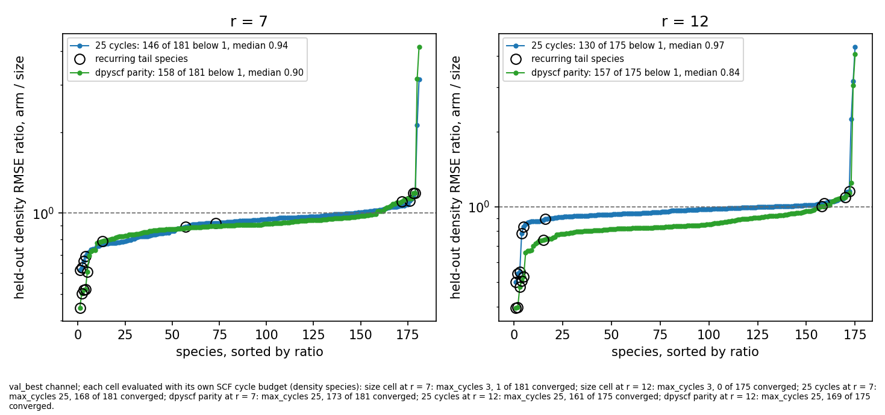

**Fig. 5.9** The 25-cycle arm and the dpyscf-parity arm against the size run's deep_3x16 cell
at 7 (left) and 12 molecules (right): per held-out species the ratio of the arm's density RMSE
to the size cell's, sorted and drawn against its rank, the ratio on a logarithmic axis, the
line at one, the eight recurring tail species as hollow markers, the counts below one and the
medians in the legend; the footer states each cell's SCF cycle budget and converged count
over the twin-collapsed held-out species (`arm_vs_size_density.png`, written by
`arm_vs_size_density.py` from the view's per-molecule records).

**Two cells set aside.** The view holds 66 trained cells and 64 evaluated ones. The held-out
passes of deep_attn_2x8 at 18 molecules and of the 25-cycle arm at 15 ran while the T1
backfill job was rewriting the benchmark reference files with a key the evaluation's
reference reader did not accept: every reference was refused, the passes wrote their tables
from no species (every metric NaN) and exited 0. The two cells' training logs, checkpoints and
in-sample evaluations, which read the training references and not the rewritten files, are
intact and appear in the tables of Sec. 4.6 of the full report; their held-out directories
are set aside locally, and their re-evaluation with the corrected reader is deferred to a
later cluster session (Sec. 6).

## 6. Pending work and open items

* Cells: deep_attn_3x16 at 26 (its training was stopped by the 48 h wall with its resume
  checkpoint set on disk; the harness relaunches it from that checkpoint once the array has
  drained), deep_attn_2x8 at 26, deep0_attn_3x16 at 15, 18 and 26, deep0_cusp_3x16 at every
  subset, the 25-cycle arm at 18 and 26 and the dpyscf-parity arm at 15, 18 and 26 are running
  or queued on the cluster. Two evaluated cells are excluded pending their re-evaluation
  (deep_attn_2x8 at 18 and deep_3x16 [25 cycles] at 15, Sec. 5.8): their held-out passes ran
  while the T1 backfill was rewriting the benchmark reference files with a key the evaluation's
  reference reader did not accept, every reference was refused and the tables were written
  from no species with the task exiting 0; the reader now accepts the key, a reference the
  reader cannot read stops the pass instead of dropping species one by one, an evaluation
  that precomputed no species is refused before any table is written; the corrected code is
  committed and not yet on the cluster, so every task whose evaluation starts before it is
  deployed writes the same tables. The deploy, the two cells' re-run by the repair job that
  re-evaluates every held-out pass of one cell, and the re-run of any further task the
  cluster's logs show refused, are one later cluster session (`docs/open_items.md`, item 33).
  The figures and tables are regenerated from the same suite as cells land.
* Meta-GGA group: the four completed certificates read FAIL and the fifth fit was cancelled
  (Sec. 3.6); the training array is held. The follow-up is in the repository: three wider
  meta-GGA architectures registered (3x32, 4x16, 4x32), the pre-training probe in
  configuration mode, and a lever study as one 48 h job awaiting submission (fourteen
  10000-step fits at the run's identity: the energy-term weight at 0.1, 10 and 100 over the
  four widths under the run's objective, and the failed run's integration objective on the
  3x16 at 0.1 and 100, each certified by the run's own certificate). The decision between the
  widths, the weight and the anchored class follows its tables.
* Converged-SCF re-evaluation: the retroactive job covered one cell-pass (deep_3x16 at 1, the
  final checkpoint, 214 of 214 species converged, 181 reactions) in about 13 h of its 24 h
  wall (the time stamps of its preflight directory, 14:00 on 2026-09-12, and of the pass,
  03:18 on 2026-09-13); at that rate the campaign's 66 cells at two checkpoints are about 1700
  node-hours, out of
  reach of the resumable single job. No converged reading is drawn from one cell, and the
  program's continuation (an array over (cell, checkpoint) pairs on the cells the density
  reading needs) is a decision still to be taken. The CCSD T1 diagnostics are on disk (203
  species, threshold 0.02), and the `_excl_t1` siblings of every density figure, the
  model-free counterpart of the `_excl_tail` view, are rendered from them (Sec. 5.8).
* The two training arms of the density program on the deep_3x16 architecture at 7, 12, 15, 18
  and 26 molecules: 25 SCF cycles with the current protocol (arm A) and the dpyscf-parity
  protocol (arm B: no convergence freeze, the executed first-mix index, the randomized
  atomic/PBE seed mixture, Adam with the plateau schedule and the Letter's L2 and channel
  weights). Their cells at 7 and 12 are in the figures (Secs. 4.4 and 5.8); 15 to 26 are
  running or queued, and arm A's cell at 15 is one of the two to be re-evaluated.
* In-sample: the suite's in-sample atomization panels stay excluded until that metric uses
  the network's own atoms; Figs. 4.1 and 4.5 carry the trained quantities instead.
